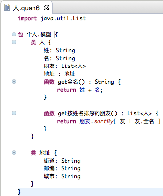

https://www.zhihu.com/question/38398662/answer/784620331

中文语法的编程语言和配套开发环境早就有，也有了相当大的用户群，但商业项目中尚未成气候。主要原因是编程语言工具本身的定位和商业运营策略。十几年前刚推出时推广的速度之快，可以看出国内对中文编程语言的巨大需求。而随着全社会越来越认识到计算机编程与各行业转型的精密关系，编程越来越成为一种基本技艺。在这个背景下，中文编程语言与开发环境的推广和商业化迎来了最佳发展机遇。

在技术上，现在开发一套中文编程语言和开发环境的代价比起十几年前要低一些，因为这么多年的开源编译器项目发展，有更多的框架、工具、资料可以利用。

比如，有现成的教程可以几乎从零开始开发一个简单的通用脚本语言

[缺图待补]

[缺图待补]

而借助语言生成工具如 xtext，更可以在十几分钟内实现基于Java的一个领域专用语言（DSL）

也可以借助 Antlr 等代码分析器生成工具，简化开发，较简便地实现下面这样的类LOGO语言

另一种方式是修改现有英文编程语言的编译器或交互控制台，实现汉化关键字和/或接口，甚至反馈信息。

下面是汉化了TypeScript的入门代码：

汉化了Python控制台的反馈错误信息：

一套中文的标准库和接口以及对应文档的开发和维护仍需要相当工作量，也很考验开发者的实践经验。即使是像上面对英文编程语言进行汉化，也需术语一致恰当。

除了中文编程语言本身的功能能够满足基本开发需要之外，一个适合中文代码输入和支持提示、补全、帮助的开发环境是决定这个语言能多容易被开发者接受的重要因素。

早在十几年前的中文编程开发环境就已经实现了中文输入法和自动补全的集成。在自动补全成为开发环境标配的今天，这个功能更是必需。而更进一步的智能提示，还依赖中文自然语言处理技术和代码分析技术。从这个角度说，中文编程语言和开发环境的探索和推广更是迫在眉睫，因为它和自然语言处理技术可以相辅相成，加速发展。

如果目标是商业大规模应用，编程语言项目如果开源，可以得到更大程度的信任，以及更多用户和合作开发者。

由于中文编程语言项目的特殊性，它还有一个优势，那就是从项目之初就可以使用中文命名标识符。对于母语命名对代码可读性的好处，之前的文章已经有了不少阐述，这里不赘述。它的特殊性就是，中文编程语言的用户必然会中文，同样会参与到语言工具本身开发中的合作者也都会中文，因此中文命名标识符没有非技术原因的障碍。

上面的脚本语言实现就在Java中使用了中文命名：

上面的LOGO语言实现是在JavaScript中用了中文命名

用中文命名标识符，不仅可以减少项目开发和维护成本，也可以一致编译器方面的中文术语，从而避免国内编译器开发者交流技术时大量夹杂英文术语的现状。

中文编程源远流长，现在就是最好的机遇。看到了很多个人和公司在进行中文编程语言和IDE的尝试和探索，相信在三年（现在是2019年）甚至更短的时间内，就可以看到更大的突破。