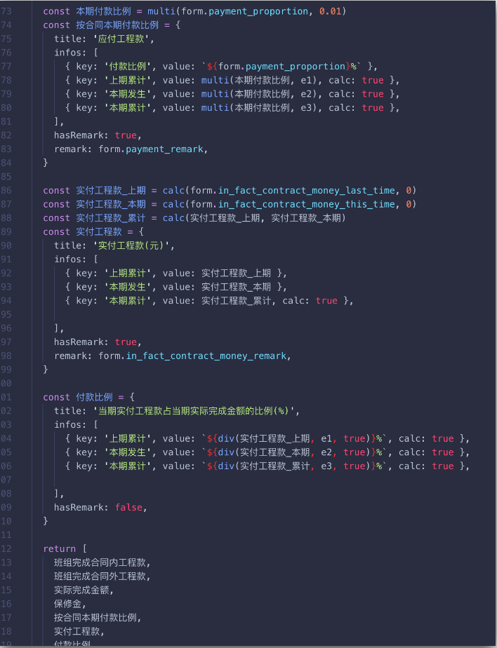
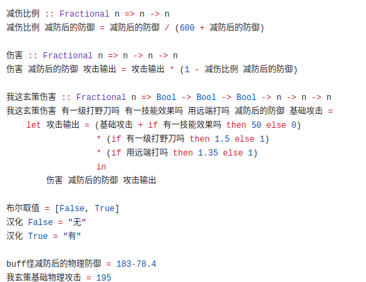

https://www.zhihu.com/question/355223335/answer/890175502

问题已被修改：

原答：

因为你没用中文写过这样的标识符（源自[这里](https://www.v2ex.com/t/615420#;)）：

还有这样的脚本（多谢 @李聲揚 的[作品](https://gist.github.com/SnowOnion/3774f0b8dbd6357541dca350297e8903)）：

所以身在福中不知福，不知道市面上[几乎所有常用英文编程语言](https://zhuanlan.zhihu.com/p/30886931)的开发者们煞费苦心支持非英文标识符的缘由：

[Python3选择支持非ASCII码标识符的缘由 40 赞同 · 6 评论文章](https://zhuanlan.zhihu.com/p/31598712)

当然，应该更不会知道日本早就出了在例程中使用日文命名的JavaScript入门译著：

还在2019年10月刚刚第五次增印：

这还仅仅是标识符使用母语命名。API命名的益处更看不到了吧。JS实例：

拿英语四级说事也是服。四级单词里的stroke是什么意思？有ellipse, canvas吗？rect又是什么鬼过了四级都能猜得到？

再看看下面的API中文化后的例程：

不说大学生，初中生对大概语义都一目了然吧。

不要把中文编程想的太狭隘，也不要太早下结论。实践出真知，你还见的太少，也做的太少。

----------------------

敬请关注中文编程知乎专栏。更欢迎加入执着的行列，踊跃投稿！

刚建的中文编程圈子：

中文编程圈 - 知乎
​www.zhihu.com/club/1193188240134332416?ab_signature=CiRBSUFsTHBScE9nOUxCYzFueEFrb2lxZVRZVWcyV2RteXpfMD0SIDNiNGE5ODQ3ZjcxNTJkMzNlYzQzNzVjMWI2Zjk1N2QzGhAIAhIGNi4yNS4wGgQxNzM4
