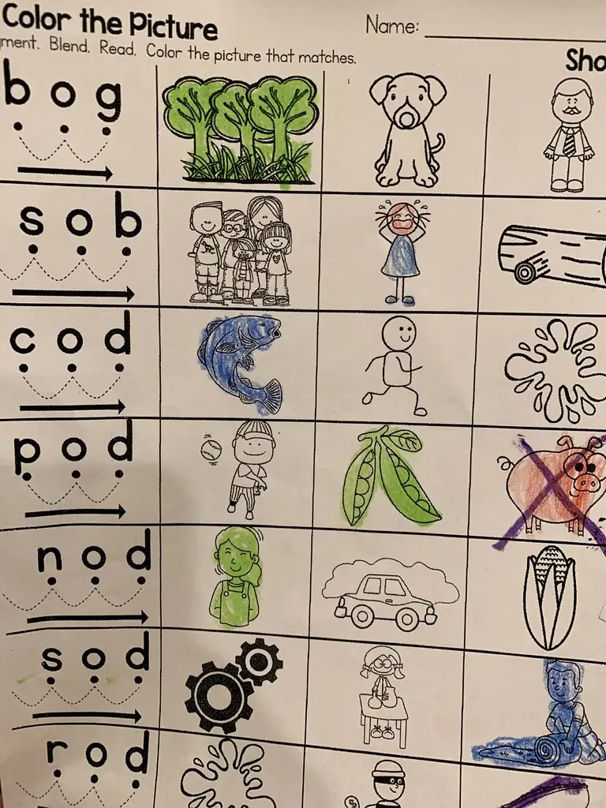

一个小实验，忍着别瞄图片，看看左侧单词都认识几个：

都是三个字母，看起来多简单！的确，因为这是美国幼儿园大班的随堂小作业。就算看了图，你都认识么？

记得我是至少三个查了字典，于是陷入了沉思—— 6 岁开始学英语，小学虽然不教但家里坚持学（无外教），初高中一路英语尖子，大学英语轻过四六级，托福不错 GRE 一般，2008 年到美国之后读书工作一直交流无碍，但是——我现在搞不定美国幼儿园的英语作业。

照时下网文的路数，接下来应是推介面向幼龄儿童的外教全英文教学环境，让他们不再重蹈父辈覆辙。

可是别急，先退一步想清楚。国人学英语的唯一目标就是达到英语国家人士的母语水平吗？

在美国过了十二年，上面单子里的词我只有个把记得用过。但这不妨碍我完成工作，因为软件项目里用不到。

小学生日常词汇和职场使用的词汇是几乎两套体系，这一点无论中英文、在国内外都类似。那么，为什么国内要从小学开始学习那么多长大之后几乎在职场用不到的词汇和用语？

一个可能的好处是，方便点融入国外生活环境，毕竟日常与周围外国友人闲聊时这些也许会有点用。

来看看到底有多少人走出了国门。关于中国海外侨民的网上资料：

从大洲分布来看，亚洲为2125万人，占83.7%；美洲245万人，占9.9%；欧洲125万人，占4.9%；大洋洲32万人，占1.2%；非洲9万人，占0.3%。
就算亚洲的一半需要英语会话，加上其他几个洲的也只有一千五百万人。

学英语的呢？2012 年的数据是三亿九千万学过英语的, 到现在估计四亿五千万挡不住（算每年新增一千五百万小学生）

出国的人数相对学英语的比例: 一千五百万：四亿五千万 = 1：30。也就是说，30 个学过英语的里只有 1 个最后有可能需要在日常用英语会话。那么剩下 96% 没出国的花上九到十六年学那么些非专业需要的英语是用来干嘛？

如果只是国内工作使用英语，总的来说“读”（默读）的需求远大于“写”的，“写”的需求又远大于“听”的，“听”的又大于“说“的。而从第二语言教学来说，学习难度是相反的，说>听>写>读。听说这两项占用学生的精力远超过一半，校外辅导更是注重，毕竟这是更能拉开分差的部分。诚然，听说对读写的进步会有辅助，但是，从工作后的实际用途看，真的值得花这么大工夫么？

对听说技能的倚重，又直接导致了英语教学的低龄化。毕竟现在普遍接受的说法是，听说技能相对于读写来说对年龄更敏感，越小开始越容易有“语感”。但问题又来了，低龄孩子同样对母语处于迅速学习阶段，那么让第二语言教学赶上母语的“唯一”途径就呼之欲出了——尽早在英语环境“沉浸”，最好外教教学甚至国外求学。

后果就是，有条件的极少数在幼龄开始上外教小班，但难免会影响母语或其他素质习得；没条件的大多数将一半多学英语的精力投入到今后多半用不到的听说技能和词汇上。

如果按照实际工作需求的侧重，以培养读写技能为主听说为辅，大可以在高中甚至大学阶段开始根据需要进行专业相关外语教学。技术人员原本不会外语为了到国外培训而在短期内习得必需外语术语和达到基本交流水平的新闻比比皆是，年纪更轻学习能力更强的学生更不在话下。最关键的是，这时候的学生已经有了完备的母语语文功底，包括逻辑、语法等等语言基本素养，而这些素养可以大大加快第二语言的学习效率，更不会影响母语水平，还减少了低龄习得第二语言的额外压力和投入，也可以省去学习非专业相关词汇。

当然，就算哪天英语不是义务教育阶段必修课了，想自己早早补习的总会有办法。

望早日看到第二语言教学从实际需求出发灵活制定学习计划和评判标准，不再一刀切。