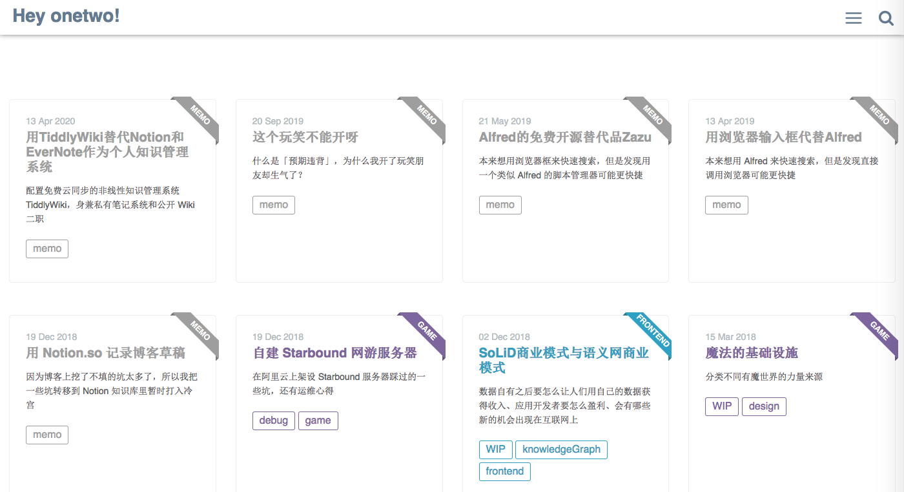
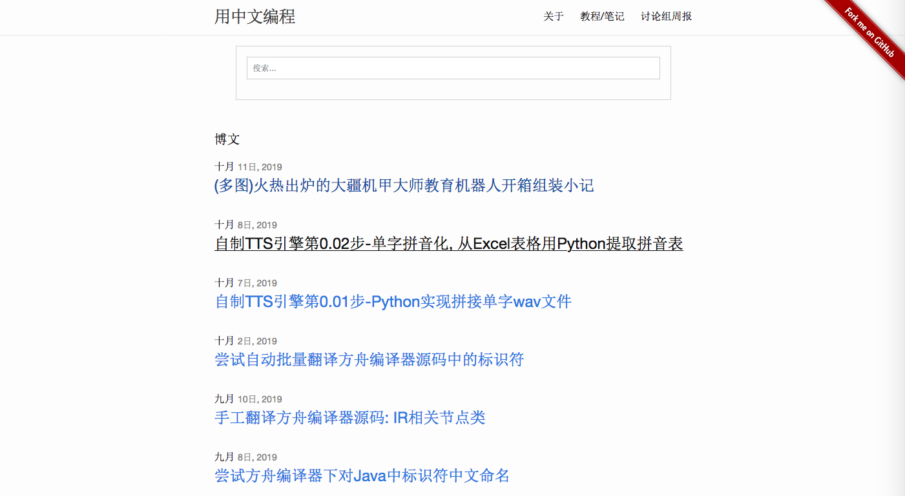
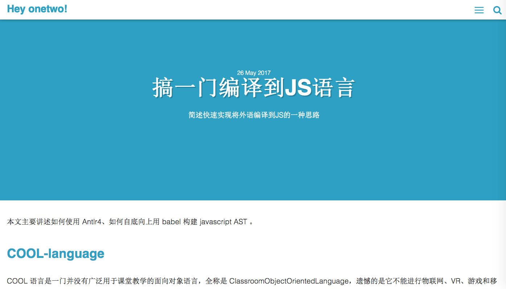
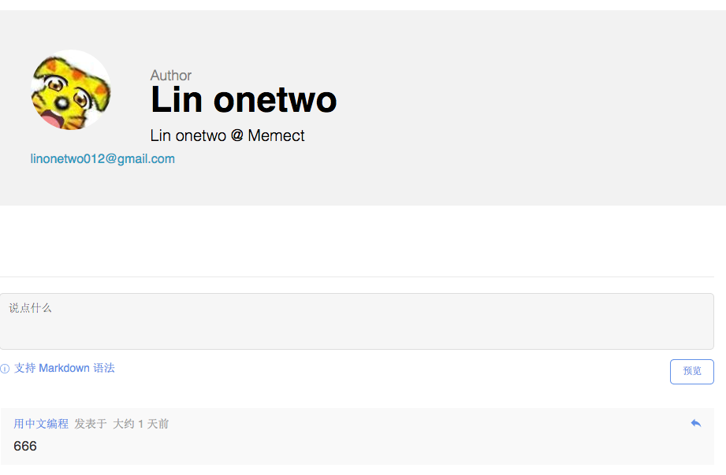
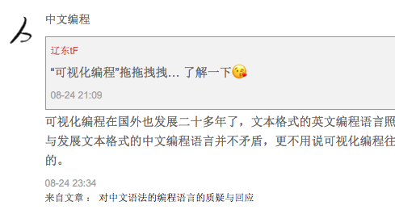

## 启动

工具自带索引，包含 git url 列表：
```
https://github.com/linonetwo/linonetwo.github.io.git
https://github.com/program-in-chinese/team_website.git
```
用 git pull 将列表中所有库下载到本地。接下去的操作如无特别说明都在本地进行，不依赖任何在线服务。

每个库下载后，对可识别的内容建立文本索引，以便搜索。

工具打开时，不时检查是否 git 库有更新内容并同步。

## 博客浏览

可以概览博客列表，包含一些基本数据：


点击进入博客，与网页版同样浏览：





## 搜索

根据关键词搜索（效果借用 gg 搜索）


点击链接打开本地对应内容



## 评论
可在任何博文下添加评论与回复其他评论。



无需任何注册服务，评论内容默认以 git 库形式存储在本地，性质与博文类似，只是带有评论对象的信息。可以回溯到最初被评论的原创内容：



与博文类似，发评论者可查看所有自己发布过的评论，也可以删除、修改。

如果想分享自己的评论，也只需将本地的评论库 push 到某个 git 平台，并将 url 加入工具自带索引。这样该工具的所有用户都将在内容更新时看到。

## 更新通知

用户可以设置关注某个博主或博文，当博主发布新博文或评论、某博文有新评论甚至内容修改就会获得通知。

关注设置暂存在本地，不在 git 库中。