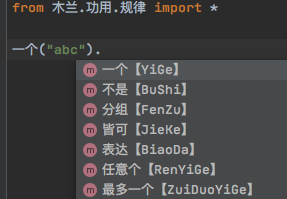
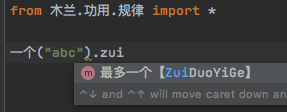
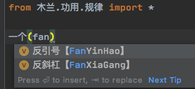

昨天做了个简单的[技术验证](https://gitee.com/MulanRevive/mulan-rework/blob/%E6%AD%A3%E5%88%99/%E6%B5%8B%E8%AF%95/unittest/%E6%AD%A3%E5%88%99.py#L37)，基本达到了[前文设想](https://zhuanlan.zhihu.com/p/323940002)中的效果：
```python
self.assertEqual(一个("a").表达(), r"a")
self.assertEqual(最多一个("$").一个("_", 大小写英文, 中文).任意个("_", 大小写英文, 数字, 中文).表达(),
    r'\$?[_a-zA-Z\u4e00-\u9fa5][_a-zA-Z0-9\u4e00-\u9fa5]*')

self.assertEqual(不是(反斜杠, 右小括号).表达(), r'[^\\\)]')

self.assertEqual(
    皆可(
        一个(反斜杠).一个(左小括号).分组(任意个(不是(反斜杠, 右小括号))).一个(反斜杠).一个(右小括号).表达(),
        一个(反引号).分组(任意个(不是(反引号))).一个(反引号).表达()
        ).表达(),
    r'\\\(([^\\\)]*)\\\)|`([^`]*)`')
```

下面尝试从目标、功能、具体设计等各方面做个规划。

## 1 目标

正则表达式（regular expression）读写不易。通过此 API 生成正则表达式，对读和写两方面进行改进。

## 2 功能

### 2.1 易读方面

  - 相对 `?<=` 这样的符号，API 命名的语义更明确
  - 可以省去正则表达式语法相关字符需要的反斜杠
  - 明确运算优先级，比如 | 和 (?<!) 等等

### 2.2  易写方面

  借助 IDE 的辅助，可看到各接口和常量，可以省去记忆各种符号。下面是安装了[此插件](https://github.com/tuchg/ChinesePinyin-CodeCompletionHelper)的效果：
  
  
  

### 2.3 潜在问题

  - 如需跨编程语言使用，需移植该 API
  - API 的表达往往比原本正则表达式冗长，需在可读与篇幅之间寻求平衡
  - API 的命名需要尽量准确简约，如果不与正则表达式语法一一对应，使用时可能需要更多适应

## 3 设计

### 3.1 大致思路

1. 尽可能减少底层 API 的数量，尽量保持与正则表达式语法的一一对应。至于有些符号如 ^ ? 等等，一个有多种用处，需酌情看是否能合并到一个 API。 

2. 与 1 相关，底层 API 的功能尽量简单，不包含优化或者复杂的转换。

3. 命名风格上，尽量使用两字或四字中文

### 3.2 正则常用语法的对应 API 示例

- abc

  一个("abc")

- ( 规律 )

  分组(规律)

- 规律1 | 规律2

  皆可(规律1, 规律2)

- ^, $

  开头, 结尾

- 规律 *

  几个(规律)

- 规律 +

  最少一个(规律)

- 规律 {m}

  重复(规律, m)

- 规律 {m, n}

  重复(规律, m, n)

- 规律 ?

  最多一个(规律)

- 规律 *?

  最小匹配(几个(规律))

- 规律 +?

  最小匹配(最少一个(规律))

- 规律 {m, n}?

  最小匹配(重复(规律, m, n))

- [abc0-9]

  `某字("abc", 数字)`。这里原本也用“一个”命名，但 `一个("abc")` 就有了歧义(与上面第一个语法)

- [^abc]

  不是("abc")

- 规律2 (?= 规律1)

  规律2.后面是(规律1)

- 规律2 (?! 规律1)

  规律2.后面不是(规律1)

- (?<= 规律1) 规律2

  规律2.前面是(规律1)

- (?<! 规律1) 规律2

  规律2.前面不是(规律1)


欢迎意见建议。