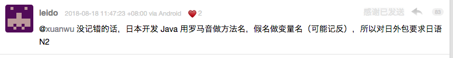
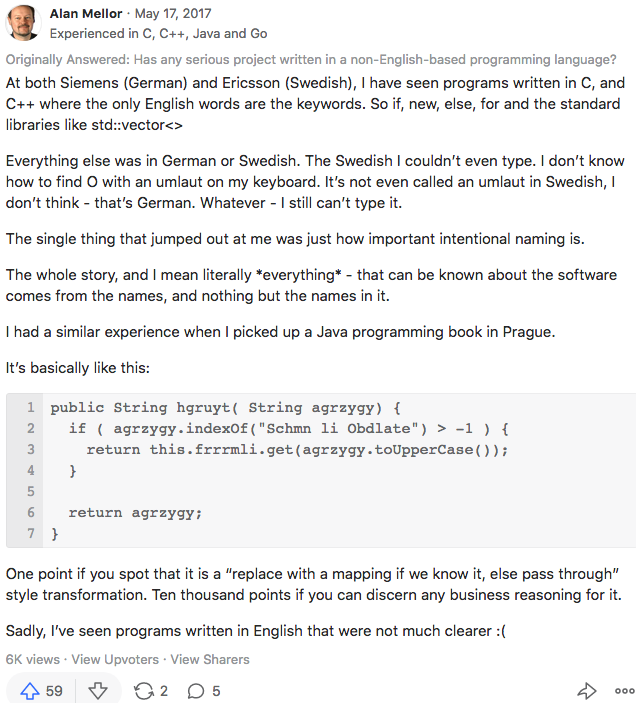

最近在一次持续数天的中文命名相关讨论中，对个人搜集的一些资料回顾了一遍。此文对非英语母语命名相关素材作一整理，暂时只有亚欧（语言）两部分。个人眼界有限，欢迎各位补充！

## 亚洲

在 [Rust 选择支持非 ASCII 码标识符在 GitHub 引发的激辩](https://zhuanlan.zhihu.com/p/92057476)中，有韩国开发者声援，但尚未看到韩语命名的实例。下面主要是日本的相关实践和研究。

早在 1992 年就有母语日文命名与英文命名标识符的[可读性比较实验](https://zhuanlan.zhihu.com/p/56756996)：


各种日文命名相关的论文包括 IDE 辅助功能研究等等延续至今。其中 2018 年《[ローマ字入力による日本語識別子入力補完プラグインの開発と評価](http://jssst.or.jp/files/user/taikai/2018/FOSE/fose1-5.pdf)》的摘要中提到日文命名标识符使代码对本国开发者的可读性提高的多份报告：

> There are several reports that it is useful to write the identier names of variables and functions in Japanese as one way to increase the readability of source codes for Japanese programmers.

2018 年日本官方发布的小学编程教育指导，[直接使用日文命名的语法和 API](https://zhuanlan.zhihu.com/p/47128031)：


在编程教程方面，2017 年出版的 JavaScript 入门译著《初めてのJavaScript 第3版 -- ES2015以降の最新ウェブ開発》中使用了日语命名的例程如下：


此书作者在计算机领域深耕多年，对将原书中英文例程改为日文命名的缘由的阐述中提到（[详见此文](https://zhuanlan.zhihu.com/p/47127716)）：

> これからは、日本国内をターゲットにした開発では徐々に日本語識別子が使われることになるのでしょう。

经有道翻译：“今后，以日本国内为目标的开发将逐渐使用日语标识符。”

另外，早在 2003 年出版的日文 MySQL 书籍中，使用了母语例程：
```sql
CREATE TABLE 社員  (
    社員番号 INT NOT NULL,
    氏名 CHAR(20) NOT NULL,
    性別 ENUM(`男`,`女`) NOT NULL,
    部署コード INT NOT NULL,
    入社年度 year NOT NULL,
    MAIL CHAR(40) NOT NULL,
    INDEX (社員番号),
    INDEX (氏名)
);
```

V2EX 论坛上的这位在 2018 年也回忆了[日本外包项目中的日语命名](https://www.v2ex.com/t/480623#r_6048174)：



## 欧洲

[2017 年的 quora 回答](https://www.quora.com/Has-any-serious-project-been-written-in-a-non-English-based-programming-language/answer/Alan-Mellor)中，指出西门子、爱立信等公司的项目使用了德语、瑞典语命名标识符：

> At both Siemens (German) and Ericsson (Swedish), I have seen programs written in C, and C++ where the only English words are the keywords. 
...

> Everything else was in German or Swedish.

另外在布拉格看到一本 Java 编程书籍中有某欧洲语言标识符命名的例程。

该答主还感叹了代码含义几乎全部来自标识符命名：

> The single thing that jumped out at me was just how important intentional naming is.

> The whole story, and I mean literally *everything* - that can be known about the software comes from the names, and nothing but the names in it.

回答全文截图如下：



同样在 [Rust 选择支持非 ASCII 码标识符的激辩](https://zhuanlan.zhihu.com/p/92057476)中，有荷兰、德国、意大利、葡萄牙、瑞士（法语）等母语命名的事例。相信在其他编程语言的类似社区讨论中会有更多发现。
