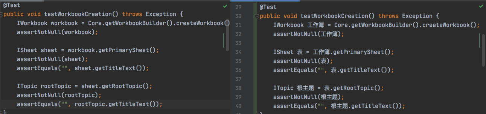
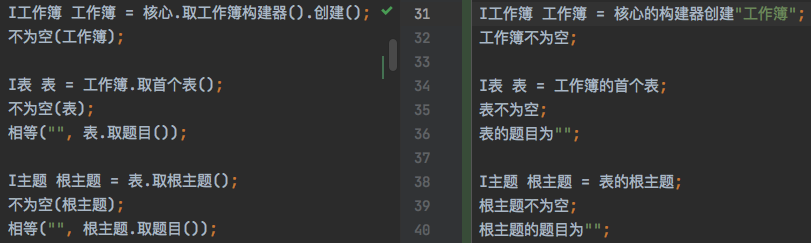
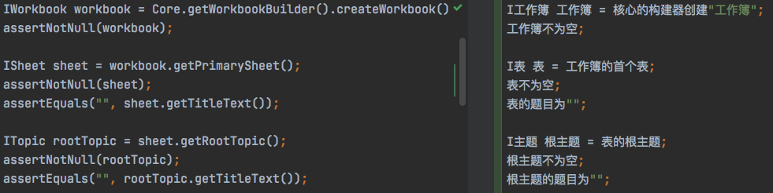

几天前开始与一位 XMind 项目参与者（下简称 c君）探讨中文编程的意义，尤其是在现有英文编程语言基本支持中文命名的情况下还有何意义。

为了避免泛泛而谈，双方同意将 XMind 开源的一段 Java 代码进行中文化，看看价值何在。于是选取了 [此测试用例](https://github.com/xmindltd/xmind/blob/377edebcdd16ad068698cebc5d76ec6d79512b7f/tests/org.xmind.core.tests/src/org/xmind/core/tests/WorkbookTestCase.java#L16)，按标识符、API、语法进行逐步中文化（如遇到反馈信息也可中文化）：
```java
    @Test
    public void testWorkbookCreation() throws Exception {
        IWorkbook workbook = Core.getWorkbookBuilder().createWorkbook();
        assertNotNull(workbook);

        ISheet sheet = workbook.getPrimarySheet();
        assertNotNull(sheet);
        assertEquals("", sheet.getTitleText());

        ITopic rootTopic = sheet.getRootTopic();
        assertNotNull(rootTopic);
        assertEquals("", rootTopic.getTitleText());
    }
```


## 第一步：内部标识符



c君确认命名中的术语无误。

## 第二步：API


junit 的相关 API 中文化是沿用[之前的设计](https://github.com/program-in-chinese/junit4_in_chinese)。

项目内部 API 的中文化并未实际实现（技术上应该可行），仅作演示用。

`createWorkbook` 简化为了 `创建`，因为没看到 `IWorkbookBuilder` 中有 create 其他类型，而且既然是 WorkbookBuilder，就不需再重复一遍 workbook。

关于接口用 I 前缀，如果追求全中文，也可以添加“接口”后缀等等。

`getTitleText` 简化为 `取题目`，因为 `ITitled` 里没看到文本之外的题目类型。

`getPrimarySheet` 中的 primary，不大确定其含义，看实现是取了第一个表，但不知是否对应界面上的第一个（最左边？）。暂且命名为“首个”。

至此，c君表示对中文命名的语义无异议。

## 第三步：语法

下面的中文语法设计的思路主要来自《[一种改进中文 API 可读性的方法：参数不限于在末尾](https://zhuanlan.zhihu.com/p/100790479)》一文。另外，`a 的 b` 等价于 `a.取b()`。第一句 `核心的构建器创建"工作簿"` 等价于 `核心.取构建器().创建("工作簿")`。

此语法的设计（包括无空格）并未与其他语法通盘考虑，仅作演示，如何实现暂不讨论。



附上《Hackers & Painters》中一段：

> I think a lot of the advances that happen in programming languages in the next fifty years will have to do with library functions. I think future programming languages will have libraries that are as carefully designed as the core language. Programming language design will not be about whether to make your language statically or dynamically typed, or object-oriented, or functional, or whatever, so much as about how to design great libraries.

之前个人拙文：
- [开发中文 API 的一些策略](https://zhuanlan.zhihu.com/p/93495675)
- [既然开发新中文编程语言离不开API, 何不从开发API开始呢? 更进一步, 何不从例程开始呢?](https://zhuanlan.zhihu.com/p/85081589)

## 意义何在

标识符 -> API -> 语法，个人认为是个自然演进的过程。

至于意义，请对比始末版本自断吧：


