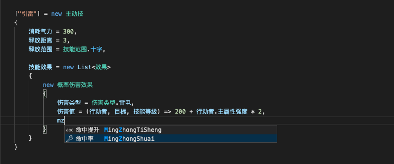

https://www.zhihu.com/question/471037078/answer/1987492172

难道英文编程只需要学会几十个语法关键词就可以编程了？

哦还真是，***如果你的应用完全不用任何编程语言标准库和第三方库、而且标识符全部用字母的话。*** 有多少实用代码能做到呢？

Java 标准库的单词量在上千：[吴烜xuan三声：使用JDT核心库解析JDK源码后初步分析API命名](https://zhuanlan.zhihu.com/p/43111638)

至于业务相关标识符的范围更广，可以把下面中文命名改成英文感受一下：

-- 源自问题报告： [多音字只能识别出来一种读音 · Issue #I1VTQ2 · 中文编程/vscode_Chinese_Input_Assistant - Gitee.com](https://gitee.com/Program-in-Chinese/vscode_Chinese_Input_Assistant/issues/I1VTQ2)

除了API和标识符，还有一个容易被忽视的方面：编译器和 IDE 的警告和报错信息。多少人看到报错就直接拷贝下来上网搜？这样的话，报错信息和给个数字索引码有任何区别吗？

英文编程工具的报错信息格式和风格几十年来几乎没有什么显著变化，母语编程工具在这方面大有可为。

在木兰重现项目中作了一点尝试供参考（***注意：木兰编程语言语法并未使用中文关键词***）：[木兰编程语言 0.0.14.4：中文报错信息规整，枚举引用新发现](https://zhuanlan.zhihu.com/p/267686876)