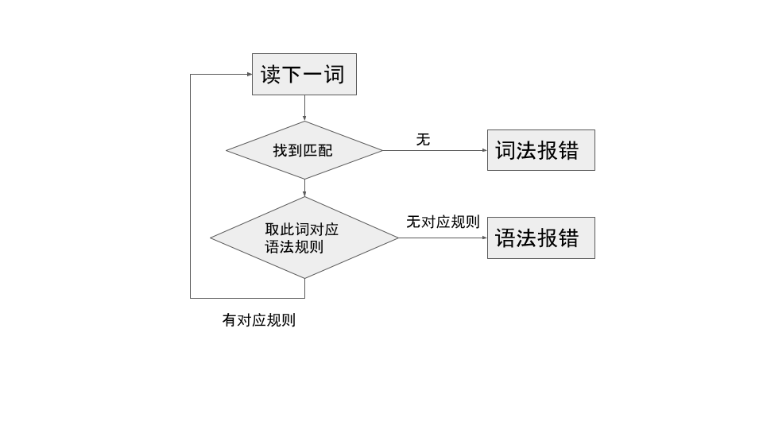
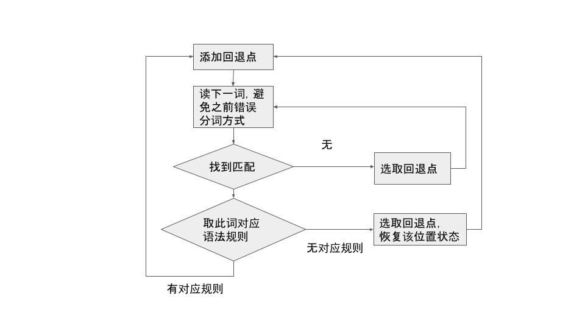

[前答](https://www.zhihu.com/question/483359591/answer/2096999846) 探讨了借鉴中文自然语言语法的编程语言设计之后，对 SQL 领域作了点中文编程语言表达的设想，比如“删除读者表”对应“DROP TABLE 读者;”、“出生年为整数”对应“出生年 INTEGER”，更多示例 [见此帖](https://gitee.com/Program-in-Chinese/overview/issues/I48P02#note_6549284_link)。

### 简易匹配分词导致的局限性

虽然开始是打算仅对设计纸上谈兵，但因为之前尝试过 [用 rply 实现简易无空格语法](https://zhuanlan.zhihu.com/p/378353764)，就想试试用 rply 能实现哪些设想中的 SQL 中文语法。于是挑了个看起来简单的“删除读者表”下手。

词法规则如下：“删除”、“表”为关键词，标识符允许任何中文字符（`r'[_a-zA-Z\u4e00-\u9fa5][_a-zA-Z0-9\u4e00-\u9fa5]*'`）。语法规则为：“删表 : 删除 标识符 表”。

结果报语法分析错误，原因也简单，[之前就发现了](https://zhuanlan.zhihu.com/p/142290539) rply 的分词方法很直白——每次按顺序遍历所有词法规则，一旦有（默认最大）匹配就被识别为词。于是首先识别了关键词——“删除”，接着识别了标识符——“读者表”，而不会根据语法规则将“读者”和“表”分为两词。

估计这是多数尝试过无空格语法设计的同好很早碰到过的坎。一个思路是，将分词和语法分析结合起来，根据语法规则对照词法表进行分词。相对中文自然语言语句的分词，因为语法规则相对局限的多，感觉更可行。

于是，就着手修改 rply 的词法语法分析部分，以图用最小代价验证这一思路（此文中涉及源码详见 [此分支](https://github.com/nobodxbodon/rply/tree/d2325d2d7923ece3657e9db74b4b863933e128a5)）。经过了多次死循环调试之后，虽说离目标感觉还远，但至少通过了几个测试用例。在潜在的南辕北辙之前，趁早回顾一下，捋清点思路和算法，还望得到指点、一同探讨。

### 解析过程举例

下面是几个测试用例逐步语法分析的过程，较直观演示当前实现的功能。想直接了解实现细节与算法流程的可以跳过此部分。

#### 例1：55

下面是测试用例的部分代码，“分词母机.添了”是词法规则（顺序敏感），“@分析器母机.语法规则”是语法规则。
```python
        分词母机.添了("关键词", r"5")
        分词母机.添了("数", r"\d")

        @分析器母机.语法规则("句 : 数 关键词")
```

对“55”进行解析的简化过程如下：

0. 读词位置从 0 开始（此步下略）
1. 第一个 5 识别为关键词，读词位置到 1
2. 不符语法规则，记录位置 0 并不是“关键词”，读词位置回退到 0
3. 再次从位置 0 开始读词，根据 #2 记录，此处并非“关键词”，因而识别第一个 5 为“数”，读词位置到 1
4. 符合语法规则，继续读词，识别第二个 5 为“关键词”【达成语法规则】

#### 例2：55，但用 \d+ 匹配“数”

与例 1 的区别是“数”可以是多位：
```python
        分词母机.添了("数", r"\d+")
```

解析“55”过程：

1. 同例 1
2. 同例 1
3. 再次从位置 0 开始读词，根据 #2 记录，此处并非“关键词”，因而识别 “55” 为“数”。读词位置到 2。另外，由于此模式可以匹配多个字符串，记下在位置 0 匹配出的长度为 2
4. 仍不符语法规则，记下位置 0 试过“数”但失败了，读词位置回退到 0
5. 根据第二步，位置0不是“关键词”；根据第三步，继续尝试匹配“数”，指定长度比 2 少 1，于是将第一个 5 识别为“数”，读词位置到 1
6. 同例 1 的第四步【达成语法规则】

“创建钟表表”的解析过程类似于此例。

#### 例3：出生年为整数

此例稍微接近点实际：
```python
        分词母机.添了('为', '为')
        分词母机.添了('整数', '整数')
        分词母机.添了('标识符', r'[_a-zA-Z\u4e00-\u9fa5][_a-zA-Z0-9\u4e00-\u9fa5]*')

        @分析器母机.语法规则("句 : 标识符 为 整数")
```

解析“出生年为整数”过程（略长请稍安勿躁）：

1. 位置 0 开始，不匹配“为”或“整数”。将整个字符串“出生年为整数”识别为标识符，读词位置到 6，记下该处匹配标识符长度为 6；记下一个回退点 0
2. 不符语法规则，记下位置 0 试过标识符但失败了，读词位置回退到 0；添加回退点 6
3. 再次从位置 0 开始读词，根据第一步，识别了长度为 5 的标识符“出生年为整”，记下该处匹配标识符长度为 5，读词位置到 5；添加回退点 5
4. 继续识别下个字“数”为标识符，记下该处匹配标识符长度为 1，读词位置到 6
5. 不符语法规则，读词位置回退到 0
6. 再次从位置 0 开始读词，识别了长度为 4 的标识符“出生年为”，添加回退点 4
7. 继续识别“整数”为关键词，读词位置到 6
8. 仍不符语法规则，记下位置 4 不是关键词“整数”***（这里是个雷！后面细说算法）***，读词位置回退到 5
9. 重复了第四步，感觉也许有bug待调试，之后读词位置又回退到位置 5，之后又回退到 4，很运气地最后回退到了 0，细节略去百字
10. 再次从位置 0 开始读词，识别了长度为 3 的标识符“出生年”，读词位置到 3
11. 顺利识别“为”，读词位置到 4“
12. 虽然第八步记下位置 4 不是关键词“整数”，此处仍同样识别【达成语法规则】

### 大略算法

RPly 是 [Ply](https://ply.readthedocs.io/en/latest/) 的一个演变版本，而 Ply 用的是 LALR(1) 分析算法。下面是 RPly 算法的简图，去除了大部细节如状态表等的操作。



下面是带回退的分析：



可见主要在于如何选取回退点，与如何避免之前错误分词方式，否则会死循环。

【猝不及防的待续】
