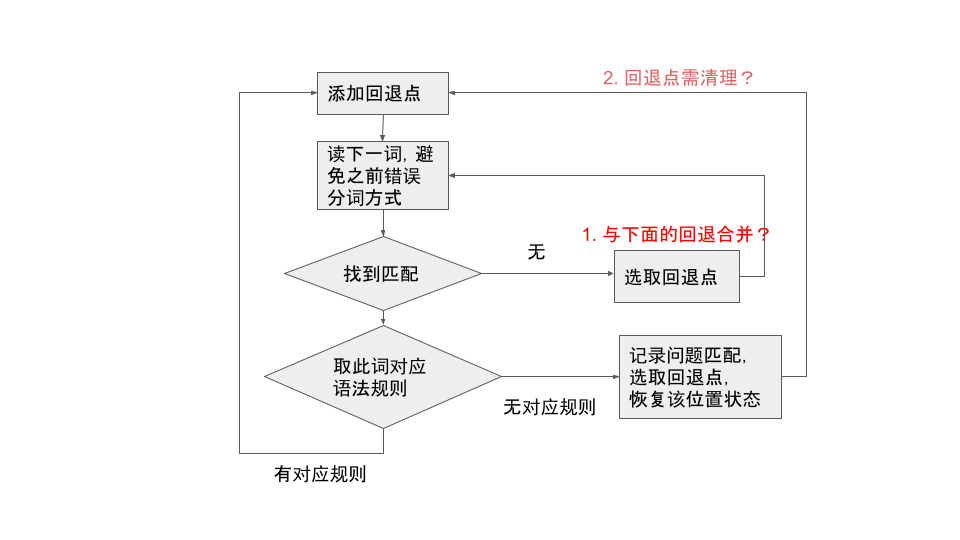

续 [前文](https://zhuanlan.zhihu.com/p/411793590)，细说算法中的主要细节与潜在问题。

当前实现的带回退的语法词法联合分析流程图修订版：

### 回退点

回退点是指可能需要重新分词的位置以及对应的状态、栈等信息（LR分析相关）。比如前文例2中的第四步，就回退到了位置 0。需要注意的是，同一个位置可能根据当前分词方式不同而对应不同状态。

回退点的添加发生在每次取下一词之前，这样取下一词后如果不符语法规则就可以回退。现在回退点从不清理，很可能是个问题。像例3的第八步，可能就是因为之前添加过回退点位置5，即便此次分词方式并不在5分隔，仍然回退到了5。也许应在每次回退后，对当前位置之后的某些不相关回退点进行清理。

现在，在两种情况下会进行回退。除了取词后发现不符语法规则的情况之外，当分词器每次取下一词失败时也会回退。这第二种情况有些存疑，待调试，最好将回退部分逻辑合并。

另一个潜在问题是报错信息的不确定性。由于解析时会尝试多种分词方法，究竟哪种分词方式是用户设想的不一定明确，尤其是如果词法报错，最后一次报错的位置不一定是“最合理的”。

越来越觉得现在添加的算法部分和深度优先搜索的相似性。每个不定长词法模式（比如 \d+、`[_a-zA-Z0-9\u4e00-\u9fa5]*`）都可能对应着多个分叉路径。当前较复杂也较没把握的部分就是选取回退点（现在是找最近的），也许应参考深度优先搜索对尝试过的读词位置进行管理，如使用栈结构。

### 避免错误分词方式

这部分的目的实际上类似于深度优先搜索中确保每个节点仅访问一次。同样重要的是，不能跳过任何未访问过的节点。问题在于，同一位置的同一词可能同时包含在错误和正确的分词方式中。比如例3中，同样是位置4的“整数”，先尝试的分词方式“出生年为 整数”是不符语法规则的，而之后尝试的“出生年 为 整数”才符合。因此如果一直记着“位置4不能分词为‘整数’”，就会错过正确的分词方式。

现在，每次发现分词不符语法规则时，在回退之前就记录下该位置的对应匹配模式，如例3的第八步。而每次选取回退点之后，比如回退到位置 0，将在位置 0 后的“位置4不能分词为‘整数’”记录清除，从而实现例3的第十二步。这就是为了避免在回退之后，被之前失败分词尝试的记录误导。

对于不定长词法模式，不仅需记录尝试匹配过的位置，还需记录该位置尝试过的长度，在之后的同位置尝试时指定逐次递减匹配长度，以实现像例 2 的第五步。rply 原本的模式匹配是带起点（pos）但不带终点（endpos）的 match，为此添加了终点参数。

### 小结待做事项

- 报错信息定位，添加对应测试用例。由于现在分词是基于语法规则的，考虑是否不再区分分词/语法报错
- 尝试参考深度优先搜索，回退点用栈结构管理
- 分词失败时与语法不符时的回退的合并
- 尝试兼容原始分析算法，通过rply原有测试用例
- 清理代码
- 性能分析

在此过程中，最好尽早消化 rply 的 LR 表相关操作及原理。