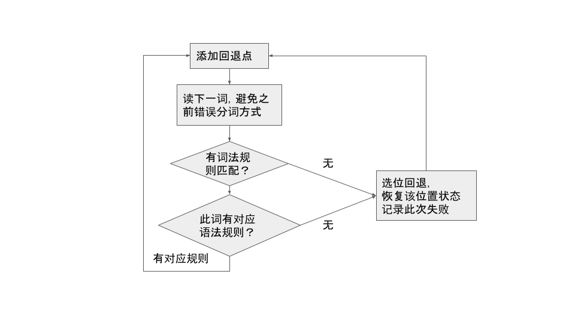
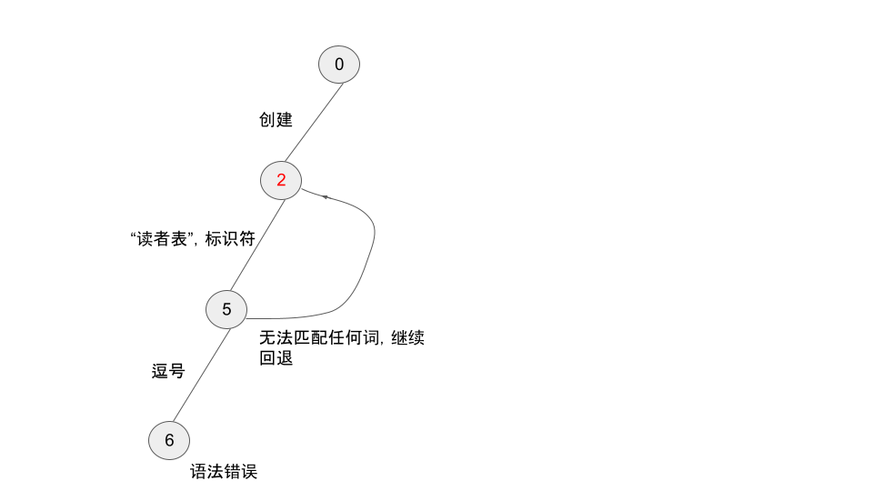
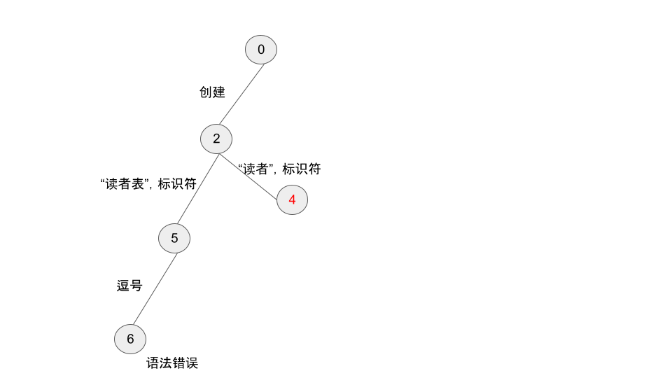
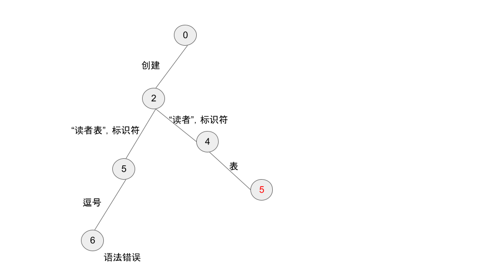
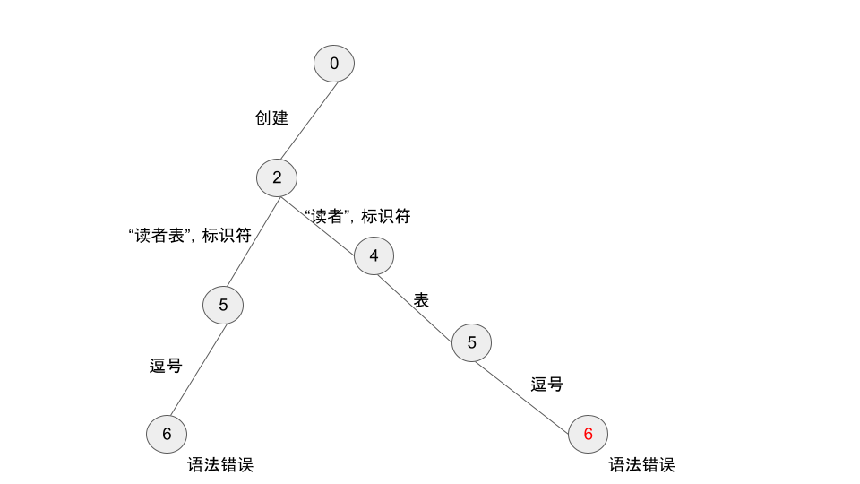

续 [之前的小结](https://zhuanlan.zhihu.com/p/411991539)，将回退点用栈结构管理、将分词失败的回退修正之后，成功通过了更多测试。

更新后的按语法分词流程如下：


当前最复杂的一个测试用例中有六条语法规则（隔天已上升到十一条），编写时发现一个语法规则错误。本文将调试过程整理一下，顺便演示当前分词算法、以及调试手段。

例程为：***创建读者表,编号为整数,出生年为文本***

一开始时为此设计的语法规则如下（摘自测试用例源码）：

```python
        @分析器母机.语法规则("建表 : 表声明 各列声明")

        @分析器母机.语法规则("各列声明 : 列声明")
        @分析器母机.语法规则("各列声明 : 各列声明 逗号 列声明")

        @分析器母机.语法规则("表声明 : 创建 标识符 表")

        @分析器母机.语法规则("列声明 : 标识符 为 列类型")

        @分析器母机.语法规则("列类型 : 整数 | 文本")
```

运行测试用例时报错——回退栈pop时发现为空，就是没能根据语法进行分词（在下当前实现的调试信息之原始可见一斑）。

当时第一反应是实现算法而不是语法规则有误，无论如何，看调试输出。为易于理解，用类似于搜索算法的图示表示分词过程：

首先从位置 0 开始，匹配了“创建”关键词，到了位置 2：


接着最长匹配了“读者表”为标识符，到了位置 5：


匹配了逗号，到了位置 6。发现语法错误，因为根据“表声明”语法，标识符后应该为“表”，于是回退到位置 5：


在位置 5 无法根据任何其他词法规则进行匹配，于是继续回退到位置 2，下面从 2 开始开始新的一个搜索分支：


匹配了短一位的“读者”为标识符，位置到 4：


匹配了“表”关键词，位置到 5：


匹配了逗号，到了位置 6。结果仍然语法错误。


不对哦，这里应该是语法正确，继续分词才对。细看相关语法规则：
```
建表 : 表声明 各列声明
各列声明 : 列声明
各列声明 : 各列声明 逗号 列声明
列声明 : 标识符 为 列类型
```

“表声明”（对应句段为“创建读者表”）之后，紧接着“各列声明”，而“各列声明”是以“列声明”而不是逗号开头。

于是在“建表”规则中间添加逗号为——“建表 : 表声明 逗号 各列声明”，测试就这样通过了~ 现在这算法的表现之好有点意料之外，主要之前死循环调试的阴影还没消。

下面的首要任务是改进调试信息、以及合并冗余结构以简化算法。

***注：本文相关源码开源在 [rply木兰定制版的无空格分支](https://github.com/nobodxbodon/rply/tree/d7fad9e9da5553c22d95886483c03f06eb659c2a)。***

顺便说句，测试源码的断言行：
```python
        assert 分析器.按语法分词(分词器.分词('创建读者表,编号为整数,出生年为文本'), 18) == '读者 各列为 编号 整数 出生年 文本'
```
其中的 18 为此测试用例的期望回退次数。