https://www.zhihu.com/question/510639541/answer/2304467718

自问自答，抛砖引玉。

四年多前对“抚子”编程语言作过 [粗浅了解](https://zhuanlan.zhihu.com/p/30800689)。去年已在 [“抚子”编程语言官网](https://nadesi.com/top/index.php?FrontPage) 看到作者 [出了本入门书](https://nadesi.com/top/index.php?%E3%81%AA%E3%81%A7%E3%81%97%E3%81%933%E6%9C%AC)。

前两天想再多了解些进展，在官网逛时看到 [15周年庆](https://www.eznavi.net/site/nade/event/15th-nadesiko/) 专栏，想着“坚持真好”进去看看，醒目头条就看到这则消息：

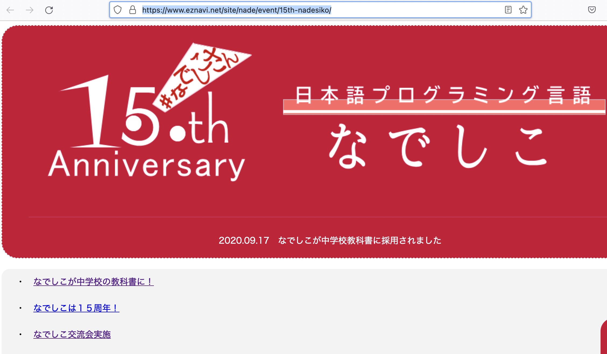

奇妙的是这个链接并无详细内容，后来才在官网找到了 2020年9月16日的博文：[なでしこが教科書に載った件 - なでしこ:日本語プログラミング言語](https://nadesi.com/top/index.php?%E3%81%AA%E3%81%A7%E3%81%97%E3%81%93%E3%81%8C%E6%95%99%E7%A7%91%E6%9B%B8%E3%81%AB%E8%BC%89%E3%81%A3%E3%81%9F%E4%BB%B6)

这是 [教科书宣传册](https://www.kyoiku-tosho.co.jp/b_data/kateika/r3_gijutsu_naiyoukaisetsu.pdf)（第十四页） 中提及的部分：

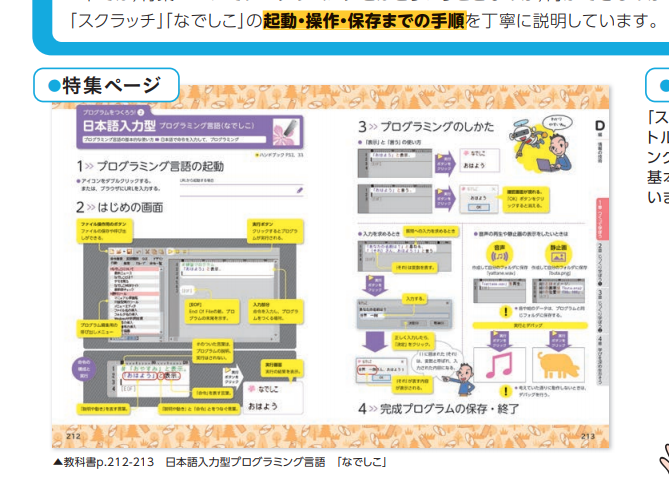

教科书实物：

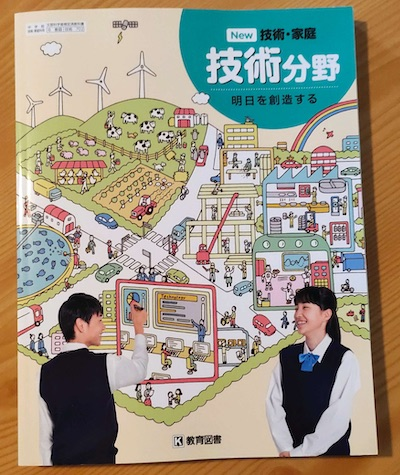

相关书页：

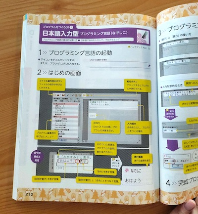

图中的应该主攻桌面应用开发和日常办公的 [抚子第一版](https://github.com/kujirahand/nadesiko)。

另外，似乎抚子第三版与2025年日本大学入学考试所用的伪代码格式 [非常接近](https://www.eznavi.net/index.php?site=ez20210407)，尚不清楚会如何应用：

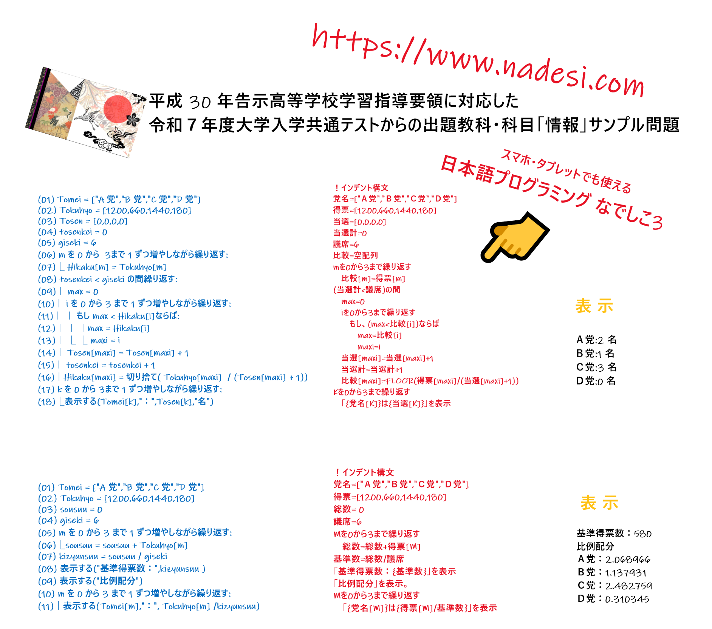

2018年时得知日本在小学编程教学中使用 [基本全日文的 Scratch 并与各学科结合](https://zhuanlan.zhihu.com/p/47128031)。

现在在中学教学中使用上了自研的更符合日文表达习惯的“抚子”编程语言，无疑又是一大步。

从官网这篇文章看，日语编程语言与 [中文编程语言几乎同时](https://zhuanlan.zhihu.com/p/98677771) 在六十年代初起步：[日本語言語の歴史定義 - なでしこ関連情報](https://nadesi.com/doc2/index.php?%E6%97%A5%E6%9C%AC%E8%AA%9E%E8%A8%80%E8%AA%9E%E3%81%AE%E6%AD%B4%E5%8F%B2%E5%AE%9A%E7%BE%A9)

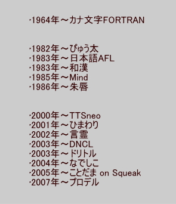

现在看来已经走在了前面。

个人认为其中有很多值得各方借鉴的，比如为何选中了抚子第一版作为教科书学习内容、日本中小学编程教学各自侧重的方面等等。

很希望一道探究。

------ 

## 背景调研

全世界各种语言按母语使用人数排名，日语排在前十（中文、西班牙语、英语、印地语、阿拉伯语、孟加拉语、葡萄牙语、俄语之后，不同资料有少许出入）。日本作为现今世界经济（GDP第三）和科技大国，国民英语教育开始的相当早，力度也不可谓不大（[见此文](https://zhuanlan.zhihu.com/p/48676955)）。到现在几乎不会英语的人数 [据此调研](http://economic.jp/?p=29982) 仍在七成左右。

另一方面，根据日本经济产业省预测，到2030年，日本程序员缺口 [在41万到79万人](https://zhuanlan.zhihu.com/p/154251480)。可以想见，日本对在编程中使用母语有相当需求，也已有很多相关实践积累。《[其他非英语母语国家在代码中使用母语命名的实践拾珠](https://zhuanlan.zhihu.com/p/339399780)》一文有日语命名的研究和实例，上面也列出了各种日语编程语言研发历程。

抚子编程语言作者是一位 20 年经验的独立开发者和编程书籍作家——クジラ飛行机：[日本亚马逊主页](https://www.amazon.co.jp/-/zh/%E3%82%AF%E3%82%B8%E3%83%A9%E9%A3%9B%E8%A1%8C%E6%9C%BA/e/B004LUJAJC?ref_=dbs_p_pbk_r00_abau_000000)、[个人网站简介](https://kujirahand.com/wiki/index.php?%E3%83%A1%E3%83%B3%E3%83%90%E3%83%BC%2F%E3%82%AF%E3%82%B8%E3%83%A9%E9%A3%9B%E8%A1%8C%E6%9C%BA)，他还开发过 [音乐编程语言](https://sakuramml.com/)，早就在教科书中使用。

这些背景，应该都与抚子编程语言入选中学技术教科书有关。

## 教科书中的抚子语言应用

由于尚无法获得教科书，先看文部科学省 [关于此书的页面](https://www.mext.go.jp/a_menu/shotou/zyouhou/detail/mext_00617.html)。由于日语基本靠机翻理解，如有错谬请指出。

教师培训/参考总共十三部分（1-1到4-2）。其中 [(D2)事例2-4,2-5  (PDF:4.4MB)](https://www.mext.go.jp/content/20210419-mxt_jogai01-000006333_007.pdf) 的 2-4 部分（20页的前十页）对抚子语言进行了介绍和使用，所占篇幅大约是十三分之一。而且还对 Web版的抚子第三版作了介绍：

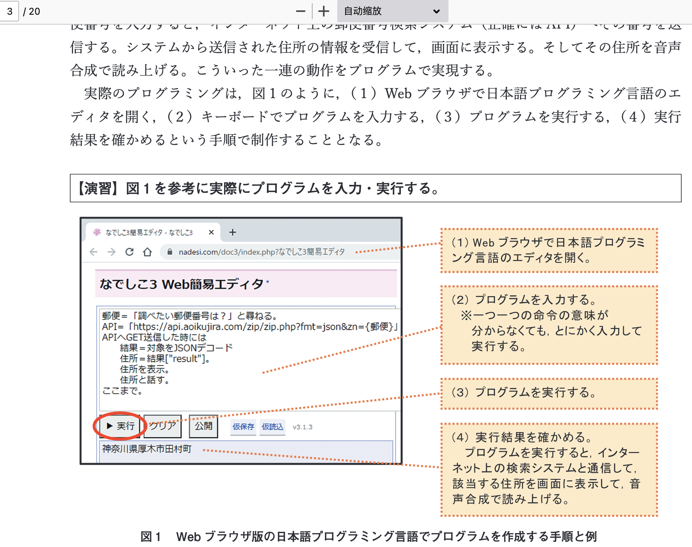

另外 [D(2)の実践事例 (PDF:8.7MB)](https://www.mext.go.jp/content/20200403-mxt_jogai01-000006333_002.pdf) （共38页） 的 13到18页 是抚子「なでしこ」语言实验部分：

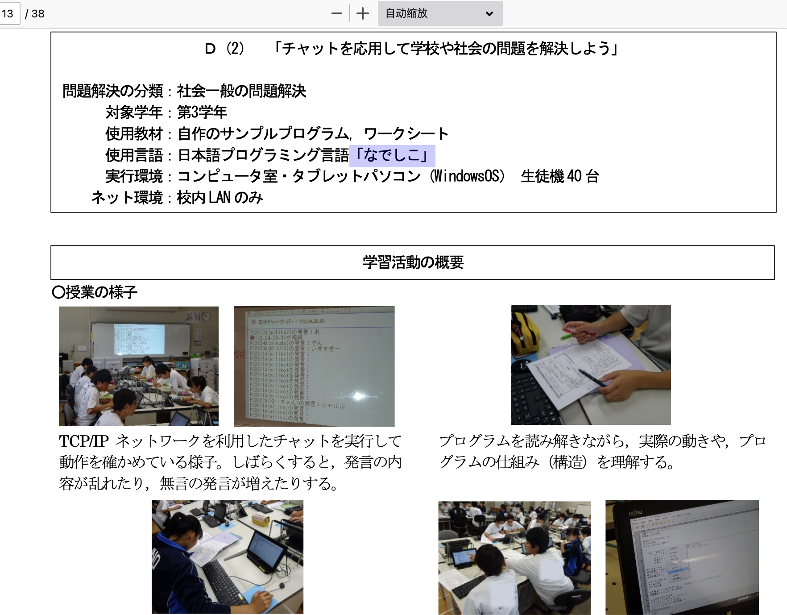

内容很细致，包括一些学生作业、反馈都有。教师培训 D(2)有五部分（2-1到2-5），这里38页中占6页。

完全使用英文编程语言的篇幅不多，仅注意到 2-5 一个部分用了 HTML/CSS/JS。除了抚子语言外，较多看到的是日文版Scratch，其中API也用日文：

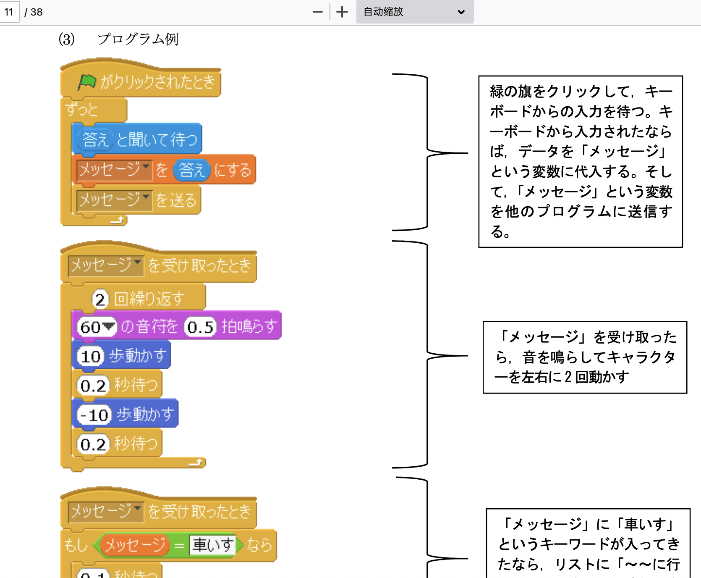

意外的是教科书中还用到了不止一个日文编程工具，比如 「ドリトル」Dolittle（之前历史可见是 2003 年问世的）：

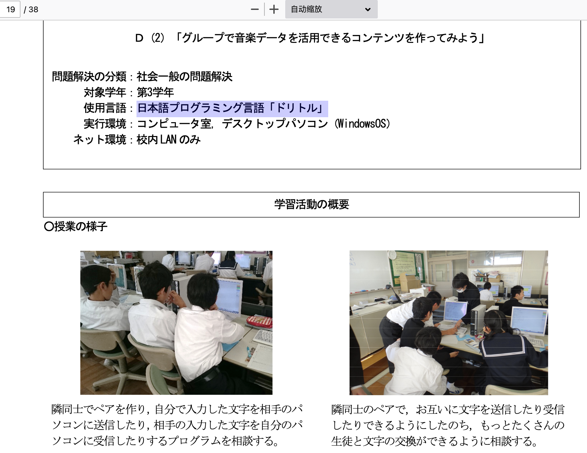

感觉这样使用多家自研开发工具的思路不错（虽然学生负担略重），但肯定会促进竞争和完善。

### “教育実践事例集”中各编程工具统计

D（1）：
- Scratch：1
- 教程附带专用编程工具（教材付属の専用プログラミングツール）：1

D(2):
- Scratch：2
- 抚子「なでしこ」Nadesiko：1
- 「ドリトル」Dolittle：1
- JavaScript：1
- 专用编程工具（専用のプログラミングツール）：1

D（3）：
- 教材専用のプログラミングツール：4
- Scratch：3（包括Scratch拓展出的工具），其中一个与 MakeCode 同用

总计：
- 教程附带专用编程工具（日文界面）：6
- 日文 Scratch：6
- 抚子「なでしこ」Nadesiko：1
- 「ドリトル」Dolittle：1
- JavaScript：1

其中专用编程工具基本有日文界面，像下面的看起来也有日文代码部分：

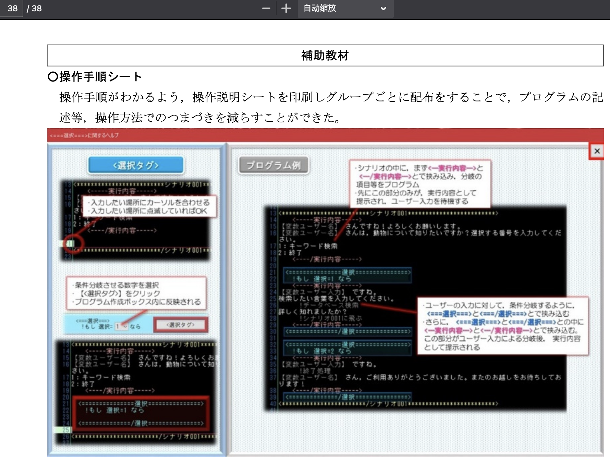

## 抚子语言和作者介绍

情報処理学会论文：《关于日语编程语言“抚子”的解释》（原文：日本語プログラミング言語「なでしこ」に関する 解説），作者即抚子语言作者：クジラ飛行机。从中可一瞥作者的创作动机和语言特色，中译版见：[第一部分](https://zhuanlan.zhihu.com/p/459786018)、[第二部分](https://zhuanlan.zhihu.com/p/460115112)

----

【抚子语言在教材中的用例细节待更】

[此教纲 (D2)事例2-4,2-5 ](https://www.mext.go.jp/content/20210419-mxt_jogai01-000006333_007.pdf) 第三页开始介绍抚子语言

[(D3)事例3-1[前半](https://www.mext.go.jp/content/20210419-mxt_jogai01-000006333_008.pdf) 有电子方面的开发环境（非抚子）

[(D3)事例3-2](https://www.mext.go.jp/content/20210419-mxt_jogai01-000006333_010.pdf) 为电子Scratch编程

[v3入门书附带例程](https://nadesi.com/top/index.php?%E3%81%AA%E3%81%A7%E3%81%97%E3%81%933%E6%9C%AC/%E3%82%B5%E3%83%B3%E3%83%97%E3%83%AB)

