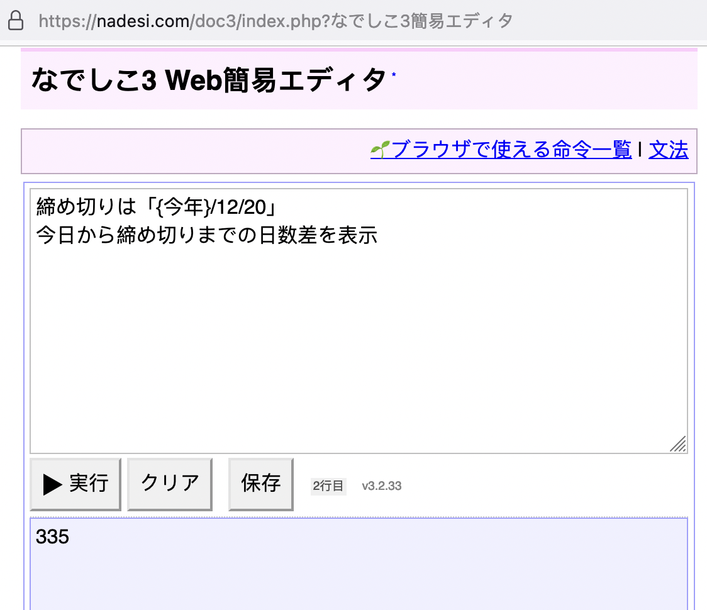
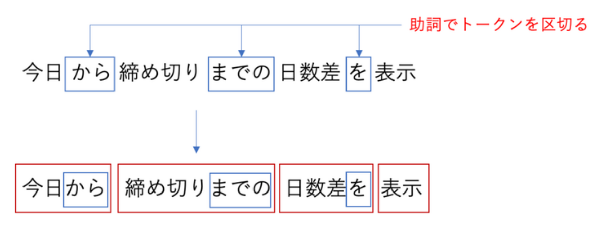

日文原文档：[日本語プログラミング言語「なでしこ」に関する 解説](https://ipsj.ixsq.nii.ac.jp/ej/index.php?action=pages_view_main&active_action=repository_action_common_download&item_id=210707&item_no=1&attribute_id=1&file_no=1&page_id=13&block_id=8)，情報処理学会・学会誌「情報処理」2021/03/15 10:44

【借助机翻，某些语句同时参考日翻中和日翻英，必有偏差请指正。【】中的部分为本人添加】

本文原作者即抚子语言作者：クジラ飛行机


## 抚子是？

“Nadeshiko”（抚子）顾名思义是一种基于日语的编程语言。这是正式版发布以来的第 16 个年头。从一开始，开发口号就是“有了抚子，任何人都可以轻松编程”。

通过基于母语的日语编程，我们希望提供男女老幼都可以编程的环境。从开发初期就以开源形式发布，采用自由度高的MIT许可证。它发布在 [此网站上](https://nadesi.com/top/)（图 1）：


顺便说一句，即使您可以用母语操作计算机，它也是一种“编程语言”，而不是“自然语言”。当然，我也考虑过自然语言的方法，但从易于分发和执行内容的准确性的角度来看，我认为编程语言的形式是合适的。

“Nadeshiko”在设计时考虑到了简单易记的语法，以实践开发口号“Easy for any”。它旨在让初学者易于记忆、使用，就像英语世界中的 BASIC 语言一样。此外，为了充分发挥母语的优点，我们强调“阅读程序即可理解操作”。

比如以下程序【含义挪到后面】。即使完全不知道抚子语法，有哪位看不明白代码吗？
```
締め切りは「{今年}/12/20」
今日から締め切りまでの日数差を表示

截止日期是“{今年} / 12/20”      // 直接机翻
显示从今天到截止日期的天数差异
```
【检查距离设定的截止日期还剩多少天】

该程序可以在浏览器上运行（图 2）。在编辑器中输入程序，按下“执行”按钮，执行程序并显示计算结果。



## 你为什么要创建一门日语编程语言？

首先，作者决定开发“Nadeshiko”，因为他想要一种用于办公自动化的语言。当时，在一家计算机相关中小型企业，通过组合各种工具完成大量任务。但是，每次都准备各色工具很困难。所以我决定创建一种简单的编程语言来自动化我的工作。

在开发通用编程语言时，往往最终只有自己会用。但是，如果可能的话，我想将它提供给公司的同事。所以我想出了一种基于日语的编程语言。即使从头开始构建一个程序不容易，我想如果我能阅读程序就理解它的操作，我就可以修改并使用它。

## 日语编程语言的好处

日语编程语言的优点是学习成本低、視認性（legibility）高。如果用英语编程语言，您必须学习英语单词才能开始编程。但是，如果用日语编程语言，则可以完全专注于编程。对于已经会编程的人来说，我认为编程所用的英语并不难。然而，当我真正听用户讲述的时候，有反馈说记不得技术术语的英语单词、害怕字母数字符号等。如果是日文编程语言，则程序可以读成日文，通过阅读就可以推断出其行为。

## 预期的目标用户是什么？

Nadeshiko 面向“编程初学者”和“想要实现处理自动化的人”。

抚子发布已经16年了，听说曾经是学生的用户已经成长为优秀的程序员。我们收到了许多“因为我是抚子所以能够开始编程”的快乐反馈。以抚子为入口，您可以升级到各种编程语言。一旦掌握了编程技能，就很容易学习另一种编程语言。

另外，作为编程入门，目前可使用 Scratch 等可视化编程语言。然而，从可视化编程语言转用成熟的编程语言存在重大障碍。因此，我希望您使用日语编程语言作为过渡（？）。由于它是一种可以用母语阅读并理解含义的编程语言，门槛较低。

并且由于“Nadeshiko”的开发动机是办公室工作的自动化，因此推荐给“想要实现工作自动化的人”。您可以使用大量自动化指令来自动化您的工作。事实上，根据去年进行的抚子用户调查发现，大部分用户都在 30 到 40 岁之间，其中也有不少人将其用于商务。

## 你可以用抚子做什么

目前，有两个版本的抚子语言，专门用于 Windows 上的办公室工作的“抚子 v1”和在 Web 浏览器上运行的“抚子 v3”。 Windows 版抚子 v1 配备了 1335 条丰富的指令，可实现办公自动化，包括Excel/Word 自动化、文件处理、GUI 编程等。

另一方面，在抚子 v3 的 Web 版本中，您可以使用 Web 浏览器的各种功能，例如制表、绘图、GPS 和文本转语音。它也适用于 Web 服务器应用开发的 Node.js。可以实现文件处理和数据库等办公工作的自动化，还可以实现机器学习和无人机操作。 

## 五分钟了解语法

这里，简单介绍一下《抚子v3》的基本语法。基于日语和基于英语的编程语言的根本区别在于如何分隔单词（token，语法的最小元素）。基于英语的编程语言最初使用空格和符号来分隔单词。但是，在日语中，没有分开语句中的单词的习惯。

我创建的第一种语言“Himawari”「ひまわり」强制用户划分每个单词。为此，在开头的程序示例中，需要像『今日から，締め切りまでの，日数差を，表示』这样在代码中不自然地添加逗号。

“抚子”采用了一种称为「助詞区切り」的规则来改善这种不自然。这里着重说明日语句子基本上是“汉字/片假名+平假名”的形式。诸如助詞「の」「と」「から」「まで」等标记被视为分隔符并自动划分（图 3）。这种机制极大地使程序更接近自然的日语并提高了視認性。



【待续】