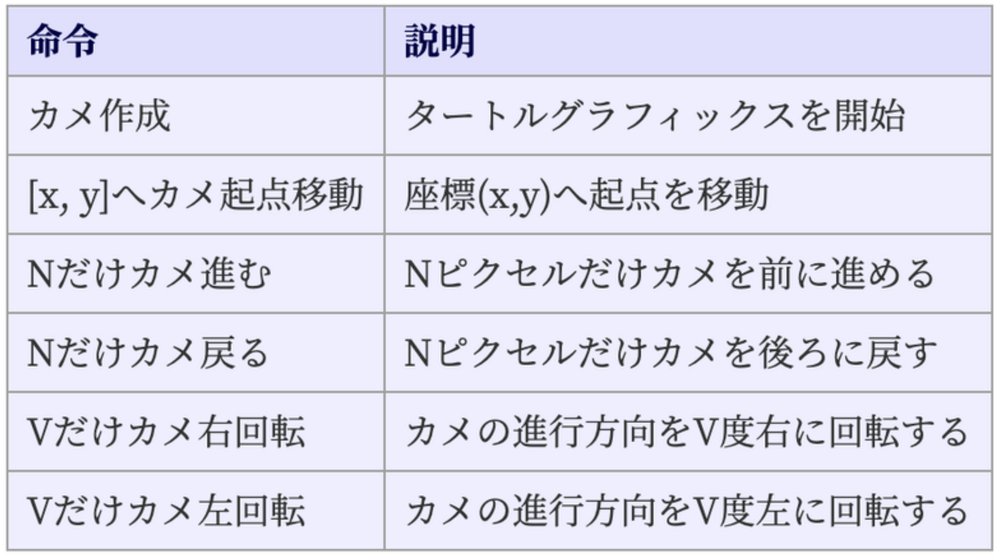

日文原文档：[日本語プログラミング言語「なでしこ」に関する 解説](https://ipsj.ixsq.nii.ac.jp/ej/index.php?action=pages_view_main&active_action=repository_action_common_download&item_id=210707&item_no=1&attribute_id=1&file_no=1&page_id=13&block_id=8)，情報処理学会・学会誌「情報処理」2021/03/15 10:44

本文原作者即抚子语言作者：クジラ飛行机

【借助机翻，某些语句同时参考日翻中和日翻英，必有偏差请指正。【】中的部分为本人添加】

## 五分钟了解语法

续 [前文](https://zhuanlan.zhihu.com/p/459786018)

然后，您可以自由地描述单词末尾的 okurigana（送り仮名）。例如，使用在屏幕上输出值的「表示」命令时，可以写「表示する」「表示しろ」「表示しよう」「表示してください」）。

此外，作为指令参数的助詞具有意义。例如，有一个命令「ＡからＢへファイルコピー」。这会将文件从路径 A 复制到路径 B。此时，即使参数的词序改变如「BへAからファイルコピー」，它也能正常工作。这将防止参数乱序。 

词序在日语编程语言中很重要。诞生于英语世界的语言有“函数(参数1，参数2，参数3)”等“动词+补语”的形式。但是，在日语中，“补语+动词”的形式很常见。因此，在抚子中，以“参数1，参数2，参数3，函数”的格式编写程序。但是，如果你想在计算公式中使用数学函数，这个词序就会不自然。因此，如果在函数后立即写括号，则可以写为“函数（参数1，参数2，参数3）”。例如，在计算分割账单的程序中使用执行舍入的函数“CEIL”的程序可以编写如下。 
```
人数は3
一人分＝CEIL(1000÷人数)
一人分を表示

人数为3
每人份 = CEIL（1000 ÷ 人数）
显示每人份
```

接下来，您可以描述赋值和算式如下。有两种方法，一种是像日语一样使用“赋值”，另一种是像通用编程语言一样使用等于（=）。您可以根据情况适当使用它。以“#”开头的行是注释。 
```
# 日本語らしく記述
1に2を足して3を掛けて答えに代入
# 一般的な言語と同じように記述
答えは(1 + 2) × 3
答え = (1 + 2) * 3

# 用日语描述
将 2 加到 1 并乘以 3 来赋值答案
# 描述方式与通用编程语言相同
答案是 (1 + 2) x 3
答案 = (1 + 2) * 3
```

而流控制是编程的一个重要元素。条件分支可以描述如下。可以说，这只是if语句在通用语言中的翻译。
```
天気＝「晴れ」
もし，天気が「晴れ」ならば
    「ピクニックへ行こう」と言う
違えば
    「家で読書しよう」と言う
ここまで

天气 = “晴天”
如果天气是“晴天”的话
    说“我们去野餐吧”
如果不是
    说“让我们在家看书”
直到这里 
```

对迭代语法使用“回文”语句。重复次数自动赋给变量“次数”。执行以下程序时，画面上会输出“1st one”、“2nd one”、“3rd one”。我认为重复的概念很容易理解，因为它是在你看到它和阅读它时执行的。

```
3回
    「{回数}回目のワン」と表示．
ここまで

3次
    显示“第{次数}个”。
直到这里
```

此外，它还具有基本的控制语法，例如『繰り返す』相当于for，『反復』相当于foreach，『(条件)の間』相当于while。

然后，我将介绍特殊变量“那”（それ），它是“抚子”独有的功能。当函数被执行时，返回结果会赋值给变量“那”。此外，如果函数的第一个参数被省略，变量“那”的内容将被用作参数。这很有用，您将能够在命令行中将类似管道的处理描述为自然日语。

例如，以下程序执行字符串处理。运行程序时，屏幕上会显示「タンゴ」。
```
それは「 りんご 」
空白除去
カタカナ変換
「リ」を「タ」に置換
表示

那是“苹果”
去除空白
片假名转换
将“リ”替换为“タ”
显示
```

依次执行去除前后多余空格的“空白去除”功能、将平假名转换为片假名的“片假名转换”功能和替换字符串的“替换”功能。变量“那”在开头只出现一次，但函数的执行结果被赋值给“那”，下一条指令的第一个参数由“那”的内容补上。指令挨个列出，值被逐个处理。

同样，前面介绍的类似日语的算式也使用了这种机制。当您运行以下程序时，将显示 20。计算在您阅读时完成，但变量“那”的值作为参数。
```
# 変数「それ」の省略を利用
2に3を足して4を掛けて表示．

# 省略变量“那”的用法
将 3 加到 2 并乘以 4 显示。
```
你也可以定义一个函数。要定义函数，请以“●（参数）函数名是......到目前为止”等格式对其进行描述。例如，以下示例定义并使用了一个名为“折扣处理”的函数。
```
# --- 関数の定義 ---
●(値段を)割引処理とは
    値段に0.8を掛けて切捨して戻す
ここまで
# --- 関数を使う ---
100を割引処理して表示

# --- 函数定义 ---
● （价格）折扣处理是
    将价格乘以 0.8 并四舍五入
直到这里
# --- 使用函数 ---
100 折扣处理并显示
```

到目前为止，我已经简单的介绍了抚子语法。基本上，词序和词分隔符的位置是不同的，但是和一般的编程语言并没有太大的区别。但是，我认为程序的含义很容易理解，因为它是日语。

## 玩海龟

在这里，我想介绍一些使用抚子 v3 可以完成的具体事情。我将介绍一些程序，都可以通过浏览器轻松执行。在以下 URL 使用 Web 编辑器很方便。
```
Nadeshiko v3 网页编辑器
[网址] http://nadesi.com/v3/new
```

首先，我想介绍一下海龟绘图。这是通过编程来操作屏幕上显示的乌龟的程序的总称。将海龟的运动轨迹绘制成图形的函数。这是一个附加在教育编程语言 LOGO 上的功能，但它也在抚子 v3 中实现，因为它是为教育目的而设计的。这个功能也有 Python 实现，可见这是编程学习的好起点。图 4 总结了这些指令。



图 4 海龟图形中使用的指令

使用海龟图形绘制六边形图形的程序如下。

```
カメ作成．
6回
    90だけカメ進む
    (360÷6)だけカメ右回転
ここまで

海龟创作。
6次
  海龟前进 90
  海龟顺时针旋转 (360 ÷ 6)
直到这里
```

执行程序时，会画出如图 5 左上角的六边形。这样，你自然可以编写出使用重复的程序。


图 5 程序执行结果

另外，如果你设计一个小变量，你可以画一个有趣的图形，这样你就可以通过编程享受绘画的乐趣（图5的右上角）。

```
カメ作成．
N=10
50回
    Nだけカメ進む
    (360÷6)だけカメ右回転．
    N=N+3
ここまで

海龟创作。
N = 10
50次
  海龟前进 N
  海龟向右旋转 (360/6)。
  N = N + 3
直到这里
```

而这是海龟图形中经常看到的例子，但是如果使用函数的递归处理，也可以绘制出模仿复杂树的图形（图5左下）。虽然是一个10行的程序，但如果你能画出一些精致的图画，就会有学习编程的动力。
```
カメ作成して[320, 500]にカメ起点移動
50だけカメ進み 28の100で枝描画
●(角度のLで)枝描画
    もし L<10ならば戻る
    Lだけカメ進み 角度だけカメ左回転
    角度の(3×L÷4)で枝描画
    (角度×2)だけカメ右回転
    角度の(3×L÷4)で枝描画
    角度だけカメ左回転して Lだけカメ戻る
ここまで
```

## Ajax 和绘制图表

接下来，我将介绍Ajax和图形绘制的功能。使用 Nadeshiko v3，您可以轻松实现 Web 应用程序中常见的功能。

例如，以下程序是使用 Web API 从邮政编码获取地址的程序。从邮政编码 221-0824 查找地址并在屏幕上显示地址。

```
ZIP = "221-0824"
API = "https://api.aoikujira.com/zip/zip.php?fmt=json&zn={ZIP}"
APIにAJAX送信した時には
　　対象をJSONデコードしてJに代入．
　　J["result"]を表示．
ここまで

邮编 = "221-0824"
API = "https://api.aoikujira.com/zip/zip.php?fmt=json&zn={ZIP}"
向 API 发送 AJAX 时
    JSON 解码目标并将其分配给 J。
    显示 J [“结果”]。
直到这里
```

助词『には』是处理回调函数的特殊语法。如上所述，写在『には』和『ここまで』之间的程序将在异步通信完成时执行。

接下来，让我们使用 CSV 文件，该文件描述了厚生劳动省作为公开数据发布的新冠阳性数量的变化。这是列出“日期、人数”的 CSV 数据。让我们用 Ajax 得到它并绘制一个图形。您可以仅用 4 行绘制图形（但是，浏览器有一个称为 CORS 的跨域限制，因此您需要将 CSV 文件上传到 Nadeshiko 编辑器，然后执行它）。

```
URL=「/v3/storage/images/6.csv」# アップしたファイル
URLにAJAX送信した時には
　　対象をCSV取得して線グラフ描画
ここまで

URL = "/v3/storage/images/6.csv" # 上传文件
向 URL 发送 AJAX 时
    获取目标的CSV并绘制折线图
直到这里
```

程序执行时，会画出如图 5 右下方的图形。使用“CSV取得”命令将 CSV 数据转换为二维数组。然后使用“绘制折线图”命令绘制图形。此命令识别一般 CSV 文件的格式并绘制图形。

## 关于未来的发展计划

直到现在，我们一直在朝着“谁都可以简单编程”的目标稳步发展。我想继续以易于阅读和理解的语言为目标。未来，除了增强使用手册之外，我还想改进浏览器上的开发环境，让编程可以在平板电脑和智能手机上舒适地完成。

最后，很高兴你能在这篇文章中尽可能地学习到日语编程语言的魅力。您可以轻松地在浏览器上制作并享受它，请尝试一次吧。

（2021年1月13日投稿）

■ クジラ飛行机 （原文作者）

自由式程序员。代表作品有音乐编程“樱花”和日语编程语言“抚子”。迄今为止，他已撰写了 30 多本技术书籍。 2001 年在线软件大奖。获得 2010 年 IPA OSS 贡献奖。