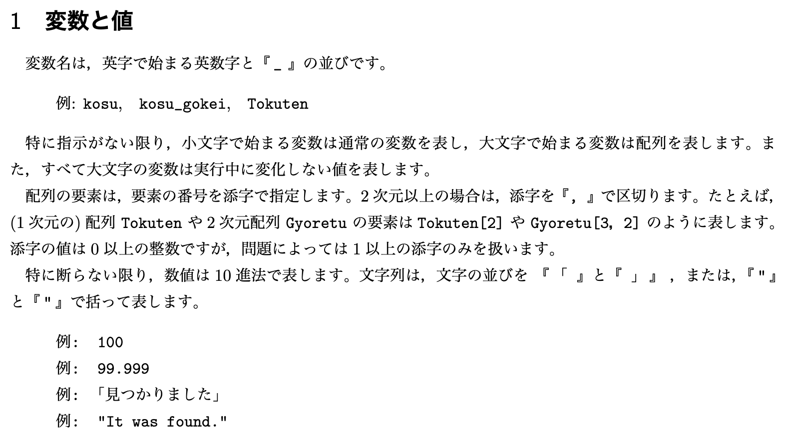
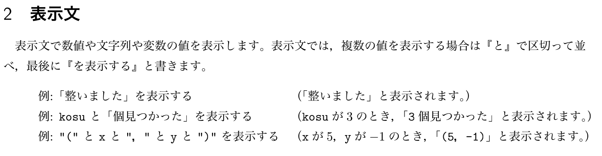
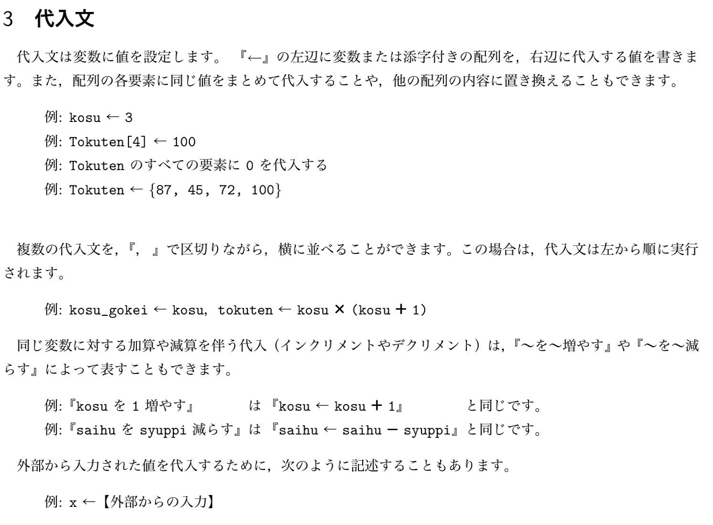
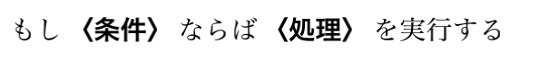
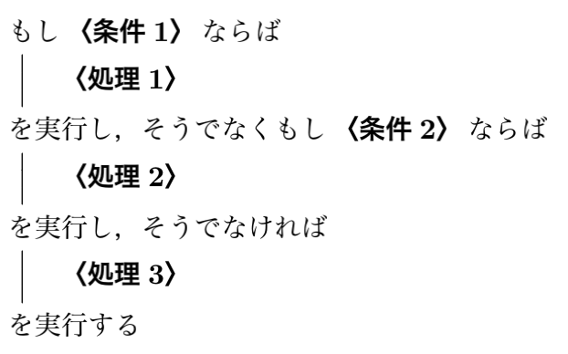
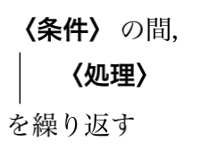
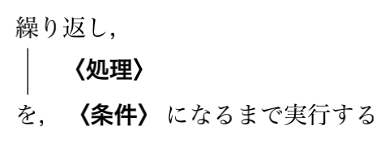
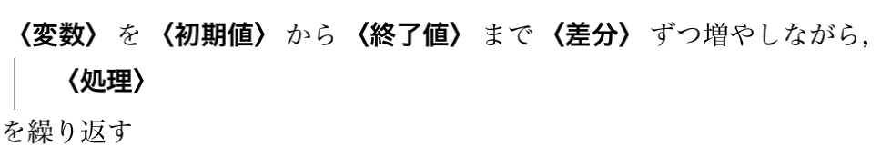
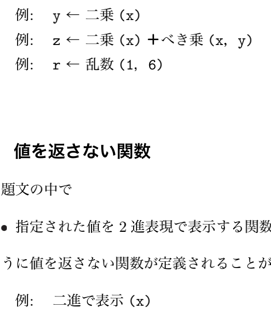

自问自答，抛砖引玉。写[前答](https://www.zhihu.com/question/510639541/answer/2304467718)时，发现 2021 年 10月13日“抚子”编程语言已支持日本高考中“信息”相关科目所用的标准语言”DNCL“。

日本高中教育内容由文部科学省制订，约每十年修订一次。令和四年（2022年）开始，高中开始“信息”学科教学，对应 2025年高考将添加“信息”科目考试。

在2020年之前，工科学校的高考就已经有“信息相关基础”科目。为规避学生使用不同编程语言的经验差距，考试使用“中心测试描述标准语言DNCL”（センター試験用手順記述標準言語），而非市面常用的编程语言。

DNCL的设计在约20年前制订，但由于入学考试中心并未提供开发环境，情報処理学会的研究者们为教学开发了各种环境。另有Dolittle语言独立开发。

2025年开始的“信息”科目考试也将使用DNCL语言，2021年3月24日发布了例题。

## 语言细节

### 第一部分 变量命名

很意外的是，用英文书写日文读音而并非直接用日文。



### 第二部分 显示

后缀『を表示する』显示输出，用『と』“和”连接各显示项。



### 第三部分 赋值


『←』将右边值赋给左边的变量或数组。支持“のすべての要素に ... を代入する”（将...赋值给所有元素）；支持『～を～増やす』や『～を～減らす』加一或减一。

这里用 ← 这种特殊符号，不知输入时是否方便。



### 第四部分 运算

包括算术、比较、逻辑运算。后两者可组合用于条件分支和循环语句

1、算术：『＋』，『－』，『×』，『 / 』四则运算，支持小数。『÷』为整数除，『％』为求余。运算符优先级如常，支持括号。

2、『＝』，『≠』（或反向），『＞』，『≧』，『≦』，『＜』，位置与数学相同。之前赋值用 ← 就可以避免与这里的 ＝ 冲突。

3、『かつ』，『または』，『でない』分别为 and、or、not。其中前两个位置与and or 相同，第三个为后置。

### 第五部分 控制语句

条件分支、条件循环、顺次循环，其中“处理”部分可以是第二、三部分（显示、赋值）以及无返回值的函数（6.2），“条件”部分可以是4.2和4.3的组合。

5.1、条件分支

如果“处理”部分只有单句，可放在一行：



下面是多重条件，类似于 if ... else if ... else：



5.2、条件循环

条件可前置：



也可后置：



5.3、顺次循环

变量从初值开始，『増やしながら』を『減らしながら』（增加或减少）“差分”（差值），超出终值时停止循环。



### 第六部分 函数

只有函数调用，未看到函数定义的语法。




## 后感

DNCL 语法中，日文自然语言风格较明显的部分是控制语句。对比英文语法 if/for/while 等语句都将关键词置于语句最前，DNCL的条件循环、顺次循环中，是将条件或变量名置于句首，而且块结尾的用语也不同。这样虽然接近自然语言，但风格稍显不同。

如果是中文语法，也许可以通过“当”对这几种语法一致化：
```
当这次 x = 3
  x = x + 1
否则当 y > 2
  y = y + 1
否则
  ...

当 x < 10
  总和 = 总和 + x
  x = x + 1


当 x 以 2 间隔从 1 递增到 10
  ...
```

注：靠机翻理解，有错请指出。

- 1、2021-12 [大学入試用の日本語プログラミング言語「DNCL」に高校教育はどう対応するべきか？](https://www.watch.impress.co.jp/kodomo_it/news/1367503.html)（高中教育应该如何对应大学入学考试的日语编程语言“DNCL”？）
- 2021-03-24 [大学入学共通テストの「情報」サンプル問題（3/24公開）について](https://www.youtube.com/watch?v=sMxwuOxjktQ)
- [令和７年度以降の試験に向けた検討について](https://www.dnc.ac.jp/kyotsu/shiken_jouhou/r7ikou.html)
- 2021-03 [日本語プログラミング言語『なでしこ』に関する解説](https://ipsj.ixsq.nii.ac.jp/ej/index.php?action=pages_view_main&active_action=repository_action_common_download&item_id=210707&item_no=1&attribute_id=1&file_no=1&page_id=13&block_id=8)
- 2021-08 [DNCL2（仮称）の学習環境の実装に関する考察](https://ipsj.ixsq.nii.ac.jp/ej/index.php?action=pages_view_main&active_action=repository_action_common_download&item_id=212372&item_no=1&attribute_id=1&file_no=1&page_id=13&block_id=8)
- [2009 日本語プログラミング言語の品格](https://crew-lab.sfc.keio.ac.jp/papers/data/Ken%20Okada/a.pdf)