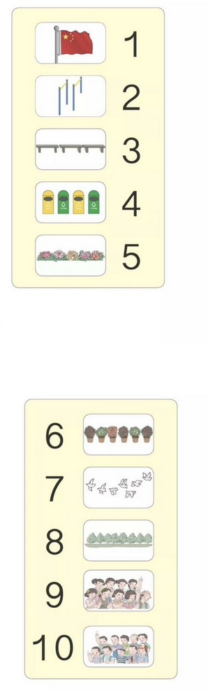
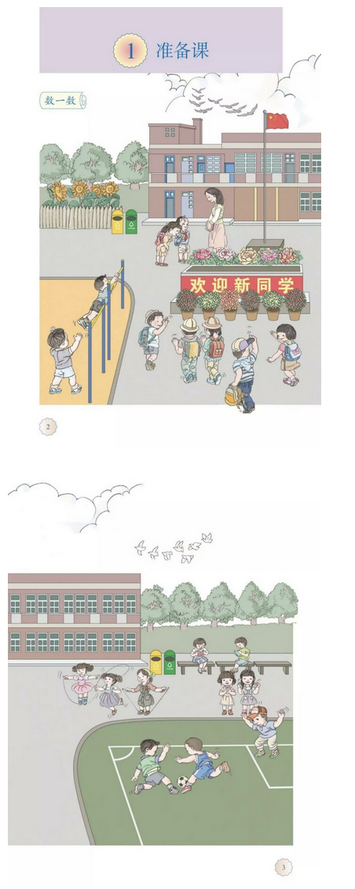
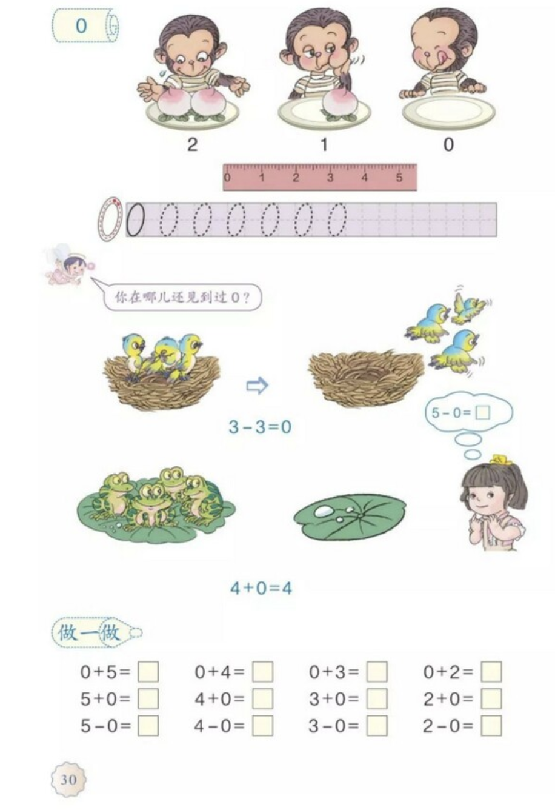

以一个没有任何知识（不认识任何字、没有任何数学知识）的个体的视角看人教版小学一年级（上）数学课本，会发现每项新知识引入时夹杂的内容。

个人教育经验粗浅，请各位指教。

## 准备课

第一课，对图中的人物进行计数如下：

首先，图片中的信息非常多。似乎课本在往绘本的方向走，然而图有非常多不确定是否相关的信息。

比如：
- 天上有两种鸟，个数还不同
- 教学楼有两层半，还有很多门窗
- 足球、老师都同样是一个
- 跳绳的有三人
- 有四朵向日葵
- “欢迎新同学”几个字应该不认识，垃圾桶上有“可回收”和“其他垃圾”字样

不用说其他细节如帽子、书包、穿着、旗帜等等。如果此课的教学目标包括归纳“同类人、物”、观察细节，固然是很好，但如果以书中列出的为“标准答案”，则难免让学生从一开始就养成定势思维。

除了选择关注点之外，在理解图片细节方面也可能会有定势。比如大树在全图中是在楼两边的：

计数是直接将两边合在一道为八，即默认楼没有遮蔽其他树。

而后面如100页的习题中，树挡住了人然而未作任何说明，是否会有学生认为“所见即所得”呢？

在此时就引入像“欢迎新同学”等字，与语文科目的进度相悖，介绍则增加了教学负担。

不仅是额外汉字，介绍 1-10 时，除了数字 1-9，还引入了 0 以及十进制表示法 10。

为何 1 和 0 并排写就是十？尤其到了第五课才正式介绍十，0也是在第三课才介绍，还是在练习题里引入的：

在一开始就将计数和阿拉伯数字、十进制混合教学，而且在十中引入数字 0 但不介绍零的概念，从知识积累的角度看颇为突兀。

个人感觉比较自然的知识积累过程是：
- 新知识基于之前的知识积累（除非是公理类知识）
- 每项新知识的引入都有明确的缘由，比如为了解决或描述某问题且之前知识无法完成
- 每次新增的知识尽量纯粹，用最少的额外信息完成介绍；每一轮的知识扩充都尽量“圆满”，避免比如十进制这种一时道不清的知识引入
- 为避免引入无关信息，课本尽量使用文字而非图片，即便用图也尽量简约

比如，此课可以用中文数字一到十规避十进制表示等知识的引入，尽量用一个数对应一个汉字的方式着重介绍“数”的概念，在必须要用到时（十以上的加法）再介绍十进制，同样在有必要使用阿拉伯数字时再引入。