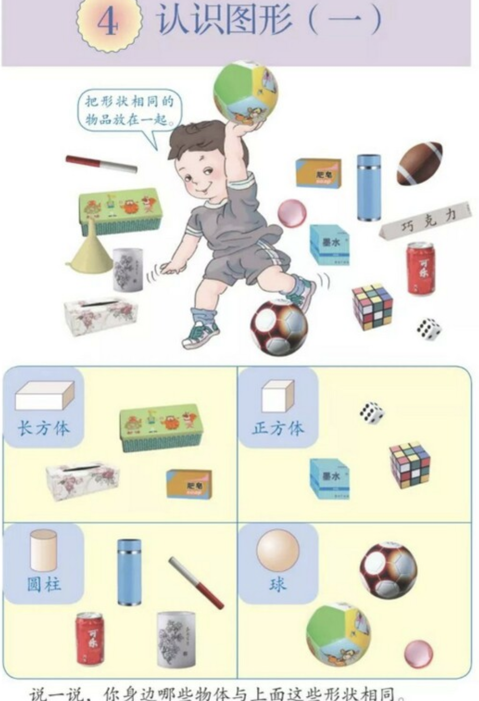

续 [前文](https://zhuanlan.zhihu.com/p/473383580)，下面是人教版小学一年级（上）数学课本第 34 页，“认识图形（一）”。

这是书中第一次提及图形，未介绍方、圆、正方、长方、柱体的概念，直接到了圆柱、正方体、长方体，还有其他形体如三棱柱、组合体（漏斗、易拉罐）、橄榄体。

图中的物品上，有如下字样：巧克力（三棱柱）、可乐（易拉罐）、肥皂 soap（长方体）、墨水（正方体盒子）

其他额外信息包括：

- 皮球上有跳跳虎图样
- 橄榄球、纸巾盒、骰子、魔方

个人不大理解选择其中一些物品的思路，尤其像橄榄球这种国内普通小学一年级学生很少了解的。又比如手上带卡通图案的皮球，如果对应脚上踢的足球，手上拿排球或篮球似乎更恰当。

关于墨水盒，现在大多数小学生应该没见过用墨水的钢笔，对圆瓶墨水瓶更是陌生。因而难以靠“盒子包装的是圆底瓶因而底是正方形，而且正面是正方形，因此整体是正方体”推出结论。如果不加解释，学生只能靠透视感来判断形体是否为“方方正正”。

另外，三棱柱上印“巧克力”，和易拉罐上印“可乐”，在我看来都属牵强。而且，易拉罐的两头缩进在图中肉眼可见，仍然被归入“圆柱”，而其他归类的形体至少肉眼上无明显不规则。

写到这里才注意到图中肥皂字样下面还有小字英文 “soap”！头回在小学数学教材中看到英文单词。翻了一下人教版一年级英文教材后的词表没看到此词（顺带惊讶，居然一年级介绍“Christmas、Father Christmas、Christmas Tree”？！）。完全不理解在此处加上陌生英文单词的用意。

如前文所言，相对于文字，在教科书的绘图中加入额外信息容易得多。这些信息是否必需、有无更恰当的，值得留意和研究。