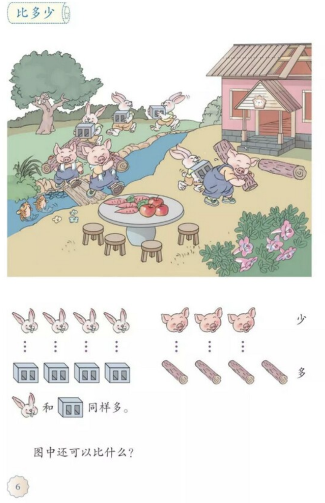
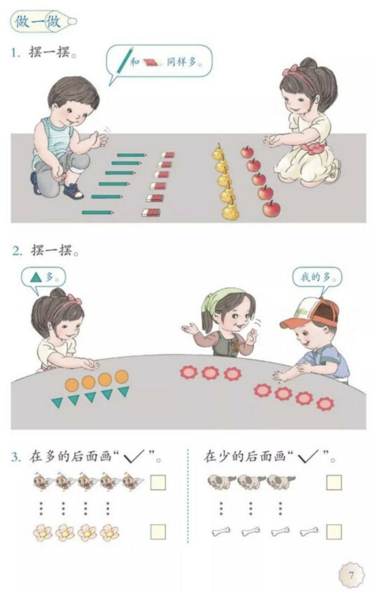

紧接着 [准备课的第一节——从一数到十](https://zhuanlan.zhihu.com/p/473383580) 之后，是“比多少”：

首先注意到的是，这里使用了一对一的方法来看多少。

那么之前先教的数数是为了什么？或者说，为何把比多少放在数数之后呢？

另一细节是，小桥是由圆木组成的，而在比较时未算进去。如前文所言，绘图的严谨性需要特别注意。

再看后一页更多例子：

这里的比较中，基本显式沿用了一对一的比较方法，除了两人比谁有更多红花。

另一个有趣的点是，两页中所有不等的例子中，都是差一个，似乎是在特意缩小差值。而现实中更多情况中差别大的多。

而且，例子中所有的比较都是直接“数得出”的物件。而未提及其他的比如树叶、头发等等。

再细看比较的事物。除了两人比谁的红花多，其他为：兔子-搬的砖、猪-搬的圆木、铅笔-橡皮、梨-苹果、圆形-三角形、蜜蜂-花、狗-骨头。

这些对子中，两方似乎都有关系，但总有些“不现实”感。思量后得出的初步结论是，包括前一节的从一数到十，都忽略了前文中设想中的知识积累过程的这一点：

> 每项新知识的引入都有明确的缘由，比如为了解决或描述某问题且之前知识无法完成

简言之，虽然大多数一年级小学生在课堂里不会提出这一问题，但恐怕这一问号会从此刻开始一直变大直到它开始影响学习效率，尤其是知识获取的开销超过了新信息带来的快感——”为啥要学这个？“

- 为啥要学数数？
- 为啥要学比多少？
- 为啥要比我和你拥有的多少？
- 为啥要比较蜜蜂和花的数量？
- 为啥要比梨和苹果的数量？
- 为啥不比花和草？

一个可能的教学路径是，将历史上的数学起源作为背景知识，让学生理解为什么需要这种能力（为了解决什么实际问题）、为啥当初选取了这种计算方式/算法（方便易用/易扩展）、这种算法的应用范围等等。更理想的是，将相关物理知识等也一道融合进来。

都说文史不分家，在我看来，**理工和历史更不应分家**。