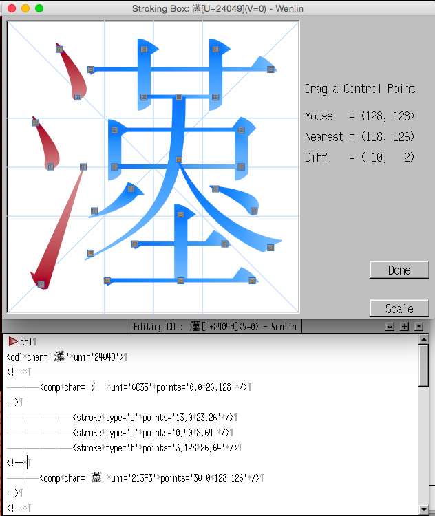

https://www.zhihu.com/question/401418696/answer/2645639246


2022-10-28 更：

汉字描述语言相关项目可参考 [此页](https://en.wikipedia.org/wiki/Chinese_character_description_languages)。CDL看起来是最接近实用的，[XML 例程](http://guide.wenlininstitute.org/wenlin4.3/Character_Description_Language) 见图，漢（#24049）由氵（#6C35）和右部（#213F3）组成：



可以 [联系授权](https://www.wenlin.com/developers) 使用原始数据，包括构成和笔画等，还有相关源码：

> CDL (Character Description Language) Database

> XML descriptions of over 82,000 CJK characters, providing stroke/component analysis, and high-quality graphic images and stroke diagrams as outlines convertible to SVG, PostScript, MetaFont, etc.


---------

2022-08

之前在想如何尽量易读地描述字的写法，可以结合几种方式：

1、笔画描述：横撇捺=大；横横撇捺，撇不出头=天

2、字形：左弓右长=张

3、对现有字的修改：恒左边改为火；大上加一横

4、混合：草字头，卫字去一横=节

更多实例记录：
```
左右结构，左边虫字旁，右边朝廷的廷=蜓
上下结构，上面雨，下面路 = 露
草字头，下面何=荷
上面矛，下面木=柔
上下结构，上面左右结构，左边日，右边上下结构，上面召，下面口，下面四点水=照
草字头，下面阴=荫
三点水，右边充下面中间加一竖=流
左边心旁，右边昔日的昔=惜
```