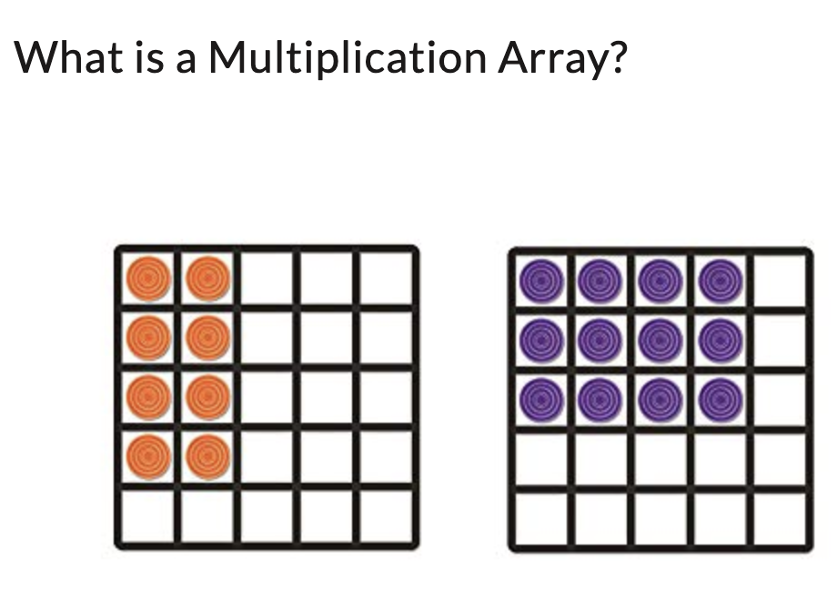

https://www.zhihu.com/question/561698913/answer/2733410735

两个小例子。

美国小学生会听到不少 program，比如 Reflections art program, after school programs。

刚学乘法的时候会用到 array：

还有之前聊过的 function。这些英文术语在生活和其他学科中的早早使用，会在学习英文编程时有助益。

编程术语中文化时，也可考虑尽量使用或参考数学等学科的相近含义术语。