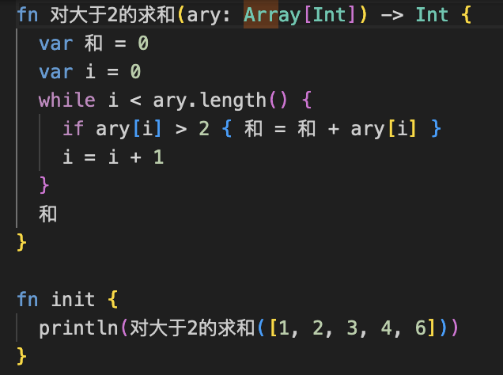
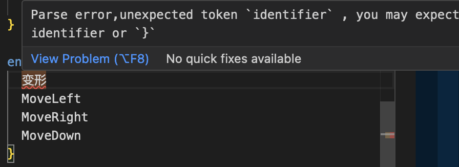
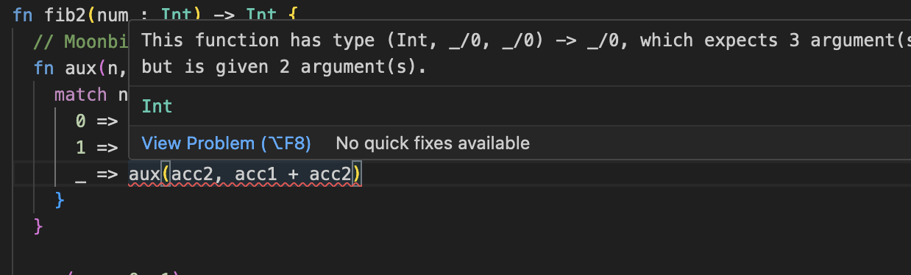

知乎答：[MoonBit国产编程语言提供中文关键字的可能性？](https://www.zhihu.com/question/632589892/answer/3310126506)

从需求看，在开发中更多使用母语是大趋势。四年前已有相当群众基础：[为什么有很多人执着于中文编程?](https://www.zhihu.com/question/355223335/answer/890175502) 中文标识符 [补全辅助插件](https://plugins.jetbrains.com/plugin/14838-chinesepinyin-codecompletionhelper) 下载已破百万，随后 Intellij IDEA 提供了[出厂默认拼音补全功能](https://youtrack.jetbrains.com/issue/IDEA-251113)。一水之隔的邻居早在三年前就在全国中学教材中 [全面使用了本地编程工具](https://www.zhihu.com/question/510639541/answer/2304467718)，近几年也看到了不止一家国内本地化的编程工具用于中小学教学实践。

简言之，现在与其讨论“可能”与否，不如先确定“国内商业化的首要目标是哪个领域和群体”，再从需求出发决定方案。

至于行动的第一步是不是关键词乃至语法的母语化，很值得商榷。已经可以看到，母语编程的范畴相当广。个人看来，将关键词母语化与其说是第一步，不如说是锦上添花的“花”。

从 [早先演示](https://zhuanlan.zhihu.com/p/343234177) 可见，在代码中 [篇幅占比更大](https://www.zhihu.com/pin/1395707910270398464) 的是标识符，在实践过程中 [有一些相对于英文的优势](https://zhuanlan.zhihu.com/p/40098652)。很高兴看到，月兔语言已初步支持中文命名标识符：

但还有些情况仍需照顾：

至于常用API的母语化，之前提到的实用化的国内编程工具都对目标领域的 API 作了本地化，这也是标识符本地化推广途中的顺其自然。

在探讨关键词之前，请回看上面图中的反馈信息。这是个人认为编程工具（包括API）本地化中的普遍盲点之一。所有编程工具的报警、报错、建议信息是在开发过程中人机交互的两个方向之一——机->人，而这是编程语言设计中常被相对忽视的。反馈信息中包含的所有术语，连同语言语法中的关键词，一同构成了整个语言工具提供给用户的“术语体系”，比如上面的'parse'、'unexpected token'、'identifier'等。这些术语是否含义明确、必须暴露给用户，反馈信息是否对用户提供了最相关有助的信息、风格是否一致、语气可否更友好，都值得推敲。

在这个术语体系完善的过程中，关键词的推敲可以融入其中，同时会影响语法设计。举个例子：

语言设计中的 fn 对应了反馈信息中的 function，如果将两者中文化为“函数”，可以做到语法和反馈信息的用词完全一致。但是，数学里函数一般有至少一个参数而月兔允许无参数，那么“函数”这个数学术语是否必须使用呢？如果换用更广义的，'argument'也可能需随之修改。另外，'type' 一词好像仅出现于反馈信息而不在语法中，那么它的含义就需要另行说明，这又牵涉到开发者需要掌握多少月兔的类型系统设计。

总之，在月兔对母语编程的支持过程中，相对于开发实现的有限工作量，设计的量更“弹性”但也更影响用户体验，尤其在反馈信息方面可以是个长期改进的过程。

下面是非技术的部分。

从描述来看，似乎当下的月兔用户群体并未表现出用非英文母语编程的强烈需求。从保障基本盘的角度看，在短期内进行生态系统的完善也许效费比更大。常用API和语言的反馈信息和使用文档的术语体系化、风格一致化等改进可以用英文实现，并不需立刻进行本地化。

短期内，在例程中积累更多使用母语标识符的代码，可以用很小的开销逐渐让用户在体验中适应母语编程。

来日方长，何必一蹴而就。