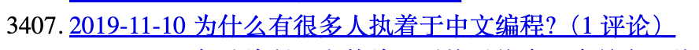
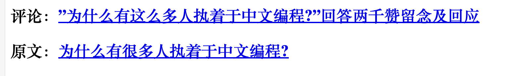
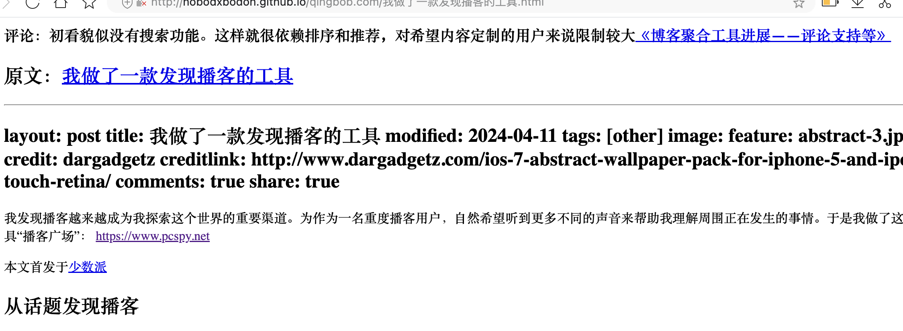
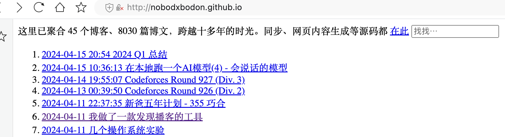
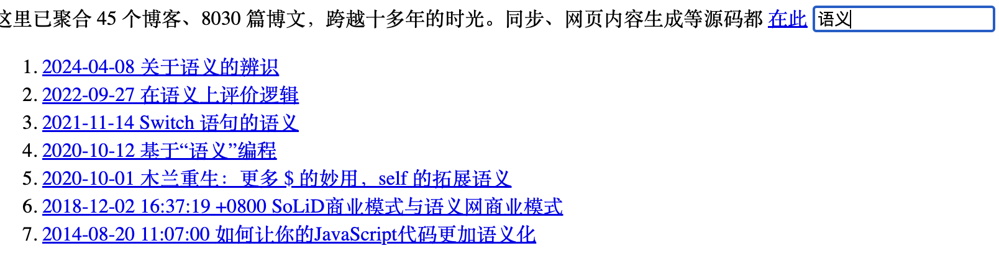

## 进展

### 初步支持评论

现在，当甲文标记为对乙文的回复，会在首页乙文标记评论数：

乙文头部会显示甲文链接：

在本地生成网页的一个独特优势是，可以将内容自行重组互联显示。今后除了对博文更细致的排序、按主题分类等，也可以支持粒度更细的前端定制，比如评论就可以内嵌到被评论的文章中或段落语句旁。即使在甲文提到乙文或其中某语句，也可以在乙文中自动添加甲文的链接。

比如说，我刚看了《我做了一款发现播客的工具》，初看貌似没有搜索功能。这样就很依赖排序和推荐，对希望内容定制的用户来说限制较大。

【待实现】上面这句评论就可以在原文显示：

### 在线演示

生成html后，作为效果演示在github pages部署。这样不需拖下所有git仓库内容也可以体验内容。图片等内容仅在本地：

### 搜索

以关键词搜索题目：

有 [更多功能](https://gitee.com/zhishi/collection-of-chinese-blogs/issues/I972IT) 待做.

### 仓库扩展

仓库总数达到四十五，博文数八千多，占本地空间约十四 GB。支持更多博文格式如 html、rst。

对md格式的html生成方面，还有很大改进空间，如 [渲染为表格有误](https://gitee.com/zhishi/collection-of-chinese-blogs/issues/I9BJ9M)。

另外，在扩展性上，现在对各仓库的支持很生硬，比如很大一块工作量是修正原文链接，需改进。

### 重构、测试

操作上，将统计和生成合并，方便了一些。

添加了一些基本单元测试。

将博文简报结构由纯字典改为类型。

## 其他待改进

当前将所有博文按时间排序集结在首页。一些博客之前停更，只会一直排得越来越后。如果按博客分组，正好一页可以看到基本所有博客和更新时间，更有宏观感。

另外，有些博客已经失去域名，逝者如斯夫。
