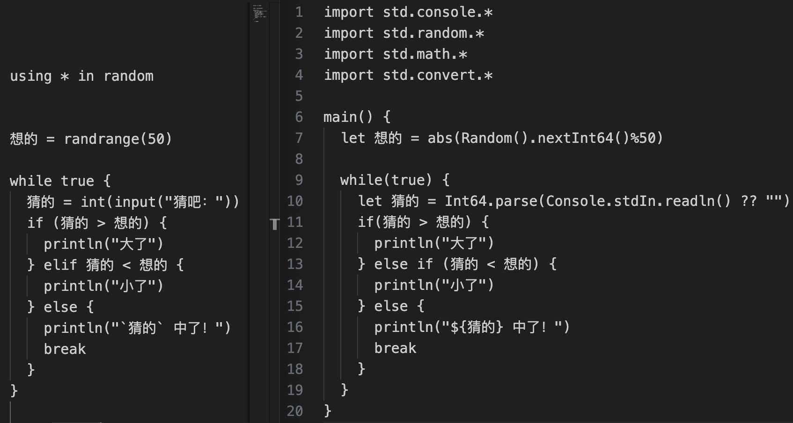

## 注：仅从个人关注的方面看两者设计，绝非两个语言项目的全面综合比拼更无意分出高下

## 猜数字例程



为对照方便，对应语句已对齐。如有错漏请不吝指教。

## 大同小异

代码的业务部分从行数和形式上都很接近。

### 相同

- 大括号用于标记代码块，即多个语句
- = 用于赋值
- 语句不需句末顿号如分号
- 支持 < > 等数学符号
- `*` 作通配符
- if else 用于条件判断
- while 用于循环
- break 用于终止循环
- true 为布尔常量
- println、abs 等为全局内置函数

### 不同

- 仓颉的中心程序需包含在 main() 中
- 仓颉赋值时用 let xx =，想到英文中的 let xx be ..
- 仓颉的大括号还用于插值
- 木兰的判断条件不需小括号

### 仓颉中符号的多义

- 小括号：条件、函数参数
- 大括号：代码块、插值取值

## 可读性

### 判断条件

木兰中不需小括号感觉更接近自然语法。

### 插值

木兰的 `` 视觉上比较轻盈，省出 $ 符号用于 [代替self及用于将关键词前缀作标识符](https://zhuanlan.zhihu.com/p/261048633)，

## 【待续】

报错机制与信息内容与风格、语法、api 命名风格（开头大小写等）、关键词

## 附录：代码文本

例程源于 [上文](https://zhuanlan.zhihu.com/p/711325333)，木兰部分为对照方便起见作了些微调整。

### 木兰

测试环境：[pypi发布版](https://pypi.org/project/ulang/) v0.1.6
```
using * in random

想的 = randrange(50)

while true {
  猜的 = int(input("猜吧："))
  if (猜的 > 想的) {
    println("大了")
  } elif 猜的 < 想的 {
    println("小了")
  } else {
    println("`猜的` 中了！")
    break
  }
}
```

### 仓颉

v0.53.4

```
import std.console.*
import std.random.*
import std.math.*
import std.convert.*

main() {
  let 想的 = abs(Random().nextInt64()%50)

  while(true) {
    let 猜的 = Int64.parse(Console.stdIn.readln() ?? "")
    if(猜的 > 想的) {
      println("大了")
    } else if (猜的 < 想的) {
      println("小了")
    } else {
      println("${猜的} 中了！")
      break
    }
  }
}
```

