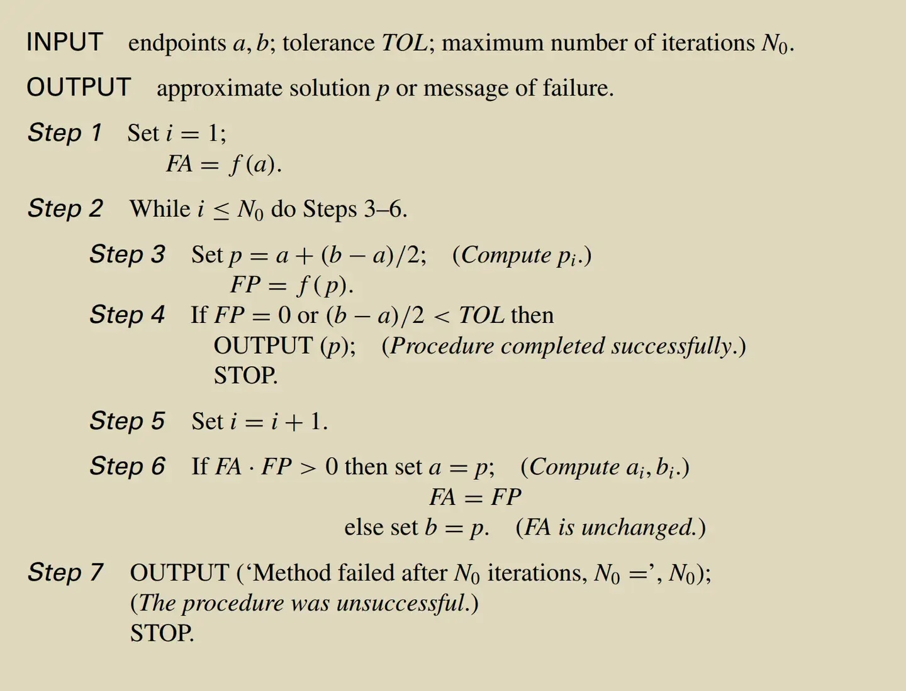
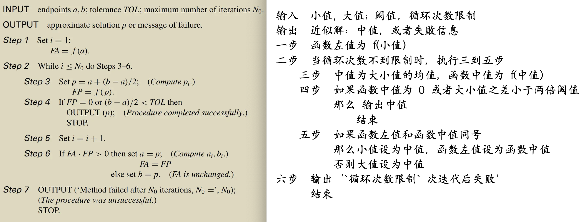

伪代码段摘自 [此答](https://www.zhihu.com/question/500406718/answer/4048091769)。



与 [前文](https://zhuanlan.zhihu.com/p/343234177) 类似逐步中文化。

## （一）标识符和字符串中文化

```
INPUT   小值, 大值; 阈值，循环次数限制
OUTPUT  近似解 中值 或者失败信息
Step 1  Set 循环序号 = 1
      函数左值 = f(小值)
Step 2  While 循环序号 <= 循环次数限制，do Steps 3-6
    Step 3  Set 中值 = 小值+(大值-小值)/2; 函数中值 = f(中值)
    Step 4  If 函数中值 = 0 or (大值-小值)/2 < 阈值 then 
              OUTPUT (中值)
              STOP
    Step 5  循环序号 = 循环序号 + 1
    Step 6  If 函数左值 × 函数中值 > 0 then
            小值 = 中值，函数左值 = 函数中值
            else 大值 = 中值
Step 7  OUTPUT（‘`循环次数限制` 次迭代后失败’）
        STOP
```

## （二）语法和部分运算符中文化

```
输入  小值, 大值; 阈值，循环次数限制
输出  近似解 中值 或者失败信息
一步  循环序号 为 1，函数左值 为 f(小值)
二步  当 循环序号 不多于 循环次数限制 时，执行三到六步
    三步  中值 设为 小值+(大值-小值)/2，函数中值 为 f(中值)
    四步  如果 函数中值 为 0 或者 (大值-小值)/2 小于 阈值    
          那么  输出 中值
              结束
    五步  循环序号 设为 循环序号 + 1
    六步  如果 函数左值和函数中值之积 大于 0
          那么 小值 设为 中值，函数左值 设为 函数中值
          否则 大值 设为 中值
七步  输出‘`循环次数限制` 次迭代后失败’
      结束
```

## （三）使用接近自然语言语法

```
【头部同（二）】
一步  函数左值 为 f(小值)
二步  当 循环次数 不到 限制 时，执行三到五步
    三步  中值 为 大小值的均值，函数中值 为 f(中值)
    四步  如果 函数中值 为 0 或者 大小值之差 小于 两倍阈值
          那么  输出 中值
              结束
    五步  如果 函数左值 和 函数中值 同号
          那么 小值 设为 中值，函数左值 设为 函数中值
          否则 大值 设为 中值
【七步同（二）】
```

## 小结

去掉空格的完整代码如下：

```
输入  小值, 大值; 阈值，循环次数限制
输出  近似解：中值，或者失败信息
一步  函数左值为 f(小值)
二步  当循环次数不到限制时，执行三到五步
    三步  中值为大小值的均值，函数中值为 f(中值)
    四步  如果函数中值为 0 或者大小值之差小于两倍阈值
          那么 输出中值
              结束
    五步  如果函数左值和函数中值同号
          那么小值设为中值，函数左值设为函数中值
          否则大值设为中值
六步  输出‘`循环次数限制` 次迭代后失败’
      结束
```

效果（字体楷体、小四）与初始的对比：



语法在严谨和可读性上尚待改进，仅作演示。

个人用一个小时左右推敲。信达雅需要时间精力，但只要用户够多，社会平均成本就能摊薄。