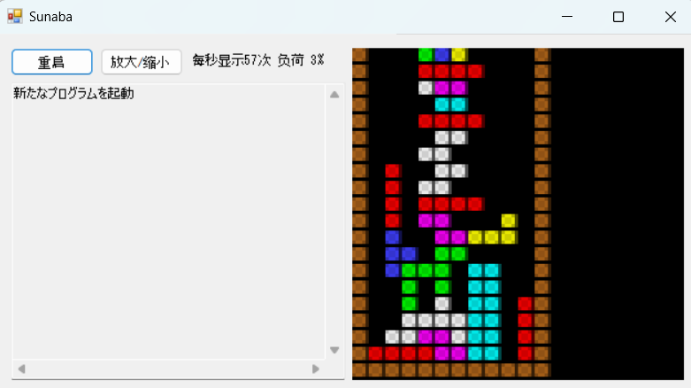

前天因 [此答](https://www.zhihu.com/question/13335584687/answer/110503876782)，又拿起五年多前 [看的《我的第一本编程书》](https://zhuanlan.zhihu.com/p/92509658)。距离中文版发行已快十年，[这是](https://zhuanlan.zhihu.com/p/109575381) 当时译者向作者也是他的老师平山尚所作。

随书语言工具 Sunaba（沙盒）[官网](https://hirasho.github.io/Sunaba/) 有关于语言设计的思路分享，比如（机翻）：

> ### 内存重写的符号通常是=

>  原因如下：

>    - 它与“等于”运算符重叠。我不想使用一个符号来达到两个不同的目的。我不喜欢“==”。
>    - 在数学中，= 有三种含义。分配、定义和关系。在数学中，这三个是根据上下文来使用的，但是有不少人不明白这一点。它很难。我不想给沙盒带来那种困难。
>    - 左边是“要操作的内存”，右边是“要设置的值”，因此含义不对称。我不想给它一个对称的符号。


将 [sunaba 源码](https://github.com/hirasho/Sunaba) 拖到本地后，在 Visual Studio 2022 打开 `src/Sunaba.sln`。sunabalib 正常打开，但提示 sunaba 部分需手工安装 .NET framework 4.8。先装了 4.8.1，发现无效，继续装了 4.8 才正常打开。

选择 Sunaba 编译生成很顺利。后发现 Program.cs 中可设置界面和语法的语言，中日韩三种可选，于是改选中文：

```c#
        //select language
//        private static string mLangName = "japanese";
        private static string mLangName = "chinese";
```

再次生成 Sunaba.exe。将中文语法的 `范例豪华版.txt` 用此 exe 打开运行如下，界面也显示中文：



反馈信息还有本地化空间。

原书中文完整例程 `范例豪华版.txt` 附在 [出版社官网](https://www.ituring.com.cn/book/1740)「随书下载」部分，片段如下：

```
只要 1 #无限循环
   如果 存储区[50009] #重新开始游戏
      纵 → 1
      横 → 5
      旋转 → 0
      种类 → 0
      下落计数器 → 0
      将格子行列的状态初始化()
      绘制墙壁和底部()
```

可以研究一下那块亮黄色  ___| 为何悬在空中。